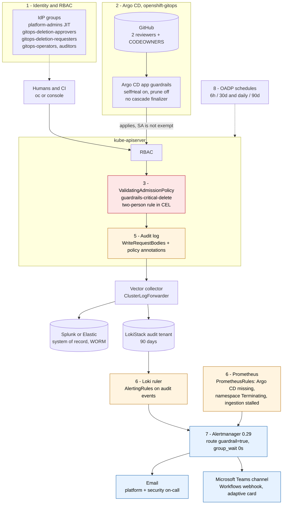
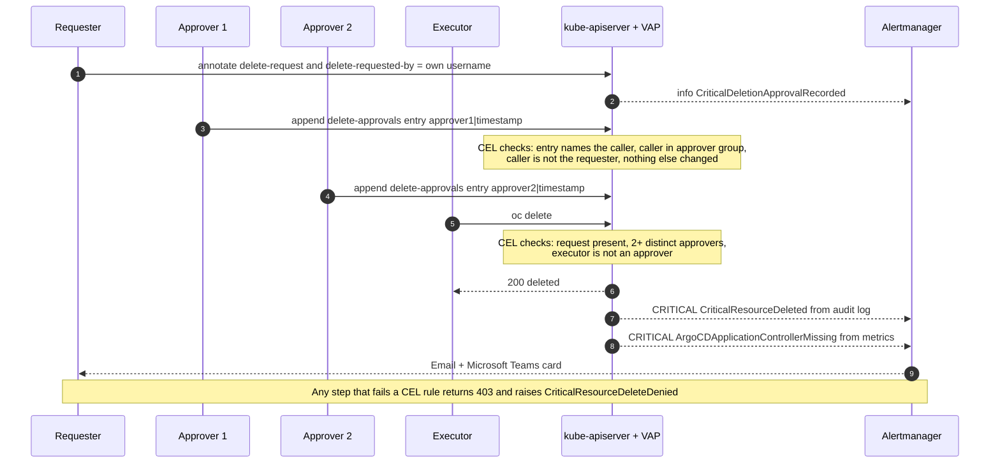

# OpenShift 4.21 – Audit Trail, Critical-Resource Deletion Guardrails and Red Alerting

Production-grade controls for an OpenShift Container Platform 4.21 cluster that runs OpenShift GitOps (Argo CD):

| Requirement | How it is met | Where |
|---|---|---|
| Every edit and deletion is attributable (who, what, when, from where) | API-server audit profile `WriteRequestBodies`, forwarded to the SIEM (system of record) **and** to an in-cluster LokiStack (for alerting), 90-day in-cluster retention, object-locked buckets | [docs/02](docs/02-audit-logging.md), `manifests/01-audit` |
| No single person, **including cluster-admin**, can delete a critical resource | `ValidatingAdmissionPolicy` inside kube-apiserver enforces a two-person rule: a deletion request plus ≥ 2 distinct approvals from a named group, executor ≠ approver. No webhook, no operator, nothing to bypass by disabling a pod | [docs/04](docs/04-deletion-guardrails.md), `manifests/03-guardrails` |
| Argo CD itself cannot be removed by one authorised user | The `ArgoCD` CR, its namespace, operator Subscription/CSV, CRDs, AppProjects and Applications are all "critical". Argo CD's own service account is **not** exempt, so removing a manifest from Git cannot delete them either | [docs/05](docs/05-argocd-protection.md), `manifests/04-argocd` |
| Any deletion (or attempt) raises a red alert to **email and Microsoft Teams** within seconds | Loki `AlertingRule`s on the audit stream + metrics-based `PrometheusRule`s (second, audit-independent channel) → Alertmanager 0.29 with `email_configs` + `msteamsv2_configs` (Teams Workflows), `group_wait: 0s` | [docs/06](docs/06-alerting-and-notifications.md), `manifests/05-alerting` |
| Still recoverable if everything else fails | OADP schedules (6-hourly) + Git as source of truth + cold-start runbook | [docs/07](docs/07-backup-and-recovery.md), `manifests/06-backup` |
| The guardrails cannot be quietly switched off | Policy objects are themselves critical, RBAC-locked, self-healed by Argo CD, and every write to them is a P1 alert. Git side: 2 reviewers + CODEOWNERS, no bypass | [docs/04 §self-protection](docs/04-deletion-guardrails.md#self-protection), [docs/08](docs/08-github-approval-workflow.md) |

Verified against: OCP 4.21 (Kubernetes 1.34, Alertmanager 0.29.0, Prometheus 3.7), OpenShift GitOps 1.19+, OpenShift Logging 6.x (`observability.openshift.io/v1`), Loki Operator 6.x, OADP 1.5.

## Architecture



## The deletion workflow in one picture



## Repository layout

```
docs/                       numbered design + operations documents (start with 00 and 01)
manifests/base/             phase-3 (enforce) definitions, kustomize
manifests/overlays/phaseN   audit-only → warn → enforce → gitops-only (Argo CD points here)
manifests/0X-*/             one directory per layer, every file has a header: purpose, phase, rollback
scripts/                    request/approve/execute/cancel a deletion, verify-install, test matrix, audit query
.github/                    CODEOWNERS, ruleset (2 approvals, no bypass), policy CI
```

## Quick start (after reading docs/10-rollout-plan.md)

```bash
# 0. replace placeholders (docs/00-placeholders.md), commit through a 2-reviewer PR
# 1. phase 1 – audit only; nothing is blocked yet
oc apply --server-side -k manifests/overlays/phase1-audit
# 2. wire secrets from the vault: logging-loki-s3, splunk-hec, alertmanager-main (SMTP + Teams URL), cloud-credentials
# 3. verify
scripts/verify-install.sh
# 4. after ≥1 week clean: phase 2 (warn) → phase 3 (enforce) → phase 4 (gitops-only) by changing the Argo CD app path via PR
# 5. sign-off: scripts/test-guardrails.sh  (expects every negative case denied, happy path allowed, alerts received)
```

## Using this repository with AI assistants

Any LLM tool can operate this repository with a few hundred tokens of context:

| File | Read by | Purpose |
|---|---|---|
| `AGENTS.md` | Codex, Cursor, Copilot, Gemini CLI, Claude Code (via `CLAUDE.md`), others | hard rules, facts, commands, read map: the only file an assistant needs by default |
| `CLAUDE.md` | Claude Code | imports `AGENTS.md`, lists skills/subagents |
| `.claude/skills/*/SKILL.md` | Claude Code (`/guardrail-*`), any tool as plain procedures | delete, investigate, verify, rollout, incident |
| `.claude/agents/*.md` | Claude Code subagents | `guardrail-operator`, `audit-investigator` (read-only), `guardrail-change-reviewer` |
| `.claude/settings.json` | Claude Code | pre-allowed read-only commands; denies CRD/namespace/policy deletes, impersonation, break-glass token minting |
| `llm/context.yaml` | any tool | the facts, machine-readable |
| `llm/memory.md` | any tool | shared durable memory + state log (phase, tests, open risks): update it |
| `llms.txt` | any tool / crawler | index of the files above |
| `.github/copilot-instructions.md`, `.cursor/rules/guardrails.mdc` | Copilot, Cursor | one-line pointers to `AGENTS.md` |

## Document index

| # | Document | Read when |
|---|---|---|
| 00 | [Placeholders](docs/00-placeholders.md) | before the first apply |
| 01 | [Threat model & residual risk](docs/01-threat-model.md) | to understand what is and is not covered |
| 02 | [Audit logging](docs/02-audit-logging.md) | designing retention / SIEM / investigations |
| 03 | [Identity & RBAC hardening](docs/03-identity-rbac-hardening.md) | before enforcing (the guardrail is only as strong as this) |
| 04 | [Deletion guardrails (VAP/CEL)](docs/04-deletion-guardrails.md) | the core mechanism, rule by rule |
| 05 | [Argo CD protection](docs/05-argocd-protection.md) | GitOps-specific hardening |
| 06 | [Alerting & notifications](docs/06-alerting-and-notifications.md) | email/Teams setup, alert catalogue |
| 07 | [Backup & recovery](docs/07-backup-and-recovery.md) | RPO/RTO, restore drill |
| 08 | [GitHub approval workflow](docs/08-github-approval-workflow.md) | repo/branch protection |
| 09 | [Runbooks](docs/09-runbooks.md) | operating it day to day and in an incident |
| 10 | [Rollout plan](docs/10-rollout-plan.md) | phased enablement with exit criteria and rollback |
| 11 | [Testing & validation](docs/11-testing-and-validation.md) | sign-off evidence |
| 12 | [Operations & compliance](docs/12-operations-and-compliance.md) | recurring reviews, control mapping |
