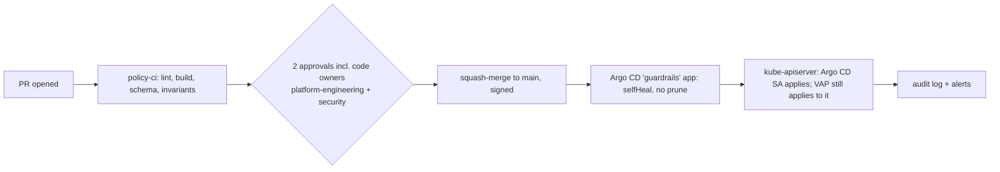

# 08 · GitHub approval workflow (Git-side two-person rule)

## Why

The cluster-side guardrail assumes the manifests in `main` are trustworthy. A single person who can merge to `main` could remove a label, add themselves to `exemptUsers` or flip `validationActions` to `[]`, and Argo CD would apply it. The repository therefore needs the same two-person property as the cluster.

## Controls

| Control | Where | Effect |
|---|---|---|
| Ruleset `main-two-person-rule`, **no bypass actors** | `.github/ruleset-main.json`, `.github/RULESET.md` | 2 approvals, code-owner review, dismiss stale approvals, approval of last push, linear history, signed commits, no force-push/delete, required check `validate` |
| `CODEOWNERS` | `.github/CODEOWNERS` | guardrail, RBAC, audit, alerting and overlay paths need **both** `@example-org/platform-engineering` and `@example-org/security` |
| CI `policy-ci` | `.github/workflows/policy-ci.yaml` | yamllint, `kustomize build` of base + 4 overlays, kubeconform schema validation, shellcheck, and **guardrail invariants**: enforce binding says Deny, no cascade finalizer / no prune on the guardrails app, no human in `exemptUsers`, `minApprovers ≥ 2`, no plaintext secrets. Optional server-side dry-run against pre-prod |
| Secret scanning + push protection | repo settings | blocks committing SMTP passwords / Teams webhook URLs (`sig=`) |
| Signed commits | ruleset | attribution of Git changes matches attribution in the cluster audit log |
| Squash merges only | repo settings | one reviewed commit per change; Argo CD history stays readable |

Team hygiene: each code-owner team ≥ 3 members with write access so two reviewers are always available; membership changes to those teams reviewed quarterly together with the cluster groups (docs/12).

## Setup

```bash
gh api -X POST repos/example-org/openshift-administration/rulesets --input .github/ruleset-main.json
gh api -X PATCH repos/example-org/openshift-administration -f allow_merge_commit=false -f allow_rebase_merge=false -f allow_squash_merge=true -f delete_branch_on_merge=true
gh api -X PATCH repos/example-org/openshift-administration -f 'security_and_analysis[secret_scanning][status]=enabled' -f 'security_and_analysis[secret_scanning_push_protection][status]=enabled'
```

Set the optional `PREPROD_KUBECONFIG` repository secret (a token for a `--dry-run=server`-only service account on a pre-prod cluster) to enable the server-side dry-run job; it catches CEL compile errors before merge.

## How a change flows



## Emergency change to the repository

Because the ruleset has no bypass, an emergency merge follows the break-glass procedure in docs/09 (two people, incident ticket, temporary ruleset change by an org admin that is itself logged in the GitHub audit log, reverted within the same incident).

## Verification

```bash
gh api repos/example-org/openshift-administration/rulesets --jq '.[] | {name, enforcement}'
gh api repos/example-org/openshift-administration/rules/branches/main --jq '.[].type'
gh pr checks <pr-number>
```
