# 18 · The story: what this project solves, why, and how

This document explains the whole solution as one narrative, written for two audiences:

| If you are | Read | Time |
|---|---|---|
| A leader who must understand the problem, the value, the cost and the risk, and approve the work | **Part 1** (chapters 1 to 7) | about 15 minutes |
| An engineer, architect, security reviewer or on-call responder who must build, run or challenge it | Part 1 for the context, then **Part 2** (chapters 8 to 19) | about 60 minutes |

Part 1 uses no jargon beyond a few terms explained where they appear. Part 2 names every file in the repository and explains what problem it solves, how it solves it and what your team has to do with it. The detailed design documents (`docs/00` to `docs/17`) remain the reference; this document is the thread that connects them.

---

# Part 1 · The story, for decision makers

## 1. The night nobody wants

It is 02:10 on a Tuesday. An experienced platform engineer is cleaning up a test environment. They have two terminal windows open: one connected to the test cluster, one connected to production. They type a single command to remove the old deployment tool from the test cluster, and press Enter in the wrong window.

In production, **OpenShift GitOps (Argo CD)** disappears. Argo CD is the system that keeps every application on the cluster in the state described in Git. With it gone:

- nothing deploys, nothing rolls back, and nothing repairs drift;
- depending on how the applications were configured, deleting Argo CD can also delete the applications it manages;
- the engineer does not notice, because the command simply said "deleted";
- nobody else is told. The first sign is a customer complaint, or a failed release the next morning.

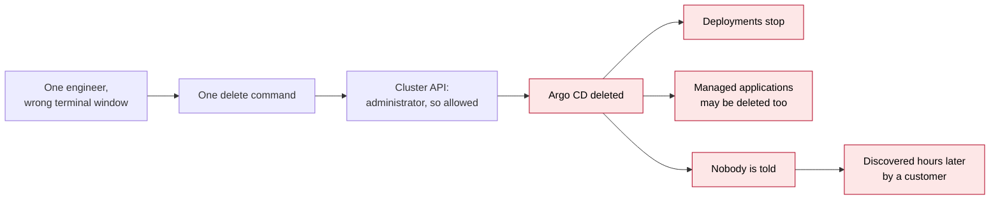

When the investigation starts, three questions come up and none has a quick answer: **who did it, what exactly was removed, and why did nothing stop it?**

On a default OpenShift cluster, the honest answers are "we can probably find out from logs, if they were kept", "we will have to reconstruct it" and "because the engineer was an administrator, and administrators can do anything with one command".

This project exists so that this night cannot happen, and so that if something similar is attempted, the right people know within a minute.

## 2. Why this matters to the business

| Risk | What it means for the organisation |
|---|---|
| **Outage** | The deployment platform is the heart of every release. Losing it stops delivery for every team on the cluster, and it can take applications with it. |
| **No accountability** | Without a reliable audit trail, an incident review ends in guesswork. Auditors (ISO 27001, SOC 2, PCI DSS) expect to see who changed what and when, for every privileged action. |
| **Single point of failure in people** | If one person can remove a critical system, the organisation's resilience depends on nobody ever making a mistake, and on no account ever being stolen. |
| **Silent failure** | A control that can be switched off quietly is not a control. An incident noticed hours later costs far more than one noticed in a minute. |
| **Insider or compromised account** | A stolen administrator credential is the most common path in serious cloud incidents. It should not be enough, on its own, to destroy critical systems. |

Banks solved this long ago for vaults: **two keys, held by two different people**. This project applies the same principle, called the *two-person rule* or *dual control*, to the most critical parts of the OpenShift cluster.

## 3. What we set out to guarantee

The project makes five promises. Everything in this repository serves one of them.

1. **Every change is attributable.** For every create, edit or delete on the cluster we can answer *who*, *what*, *when* and *from where*, and keep that evidence where it cannot be tampered with.
2. **No single person can delete a critical resource outside the approved process, not even a full administrator.** A direct deletion needs a request, two independent approvers and a separate person to carry it out.
3. **Argo CD itself is protected by the same rule.** The deployment platform, its configuration, its installation and its data types are all "critical".
4. **Any deletion, or attempt, raises a red alert by email and in Microsoft Teams within about a minute,** so the owning team can act immediately. Attempts to disable the protection raise the loudest alerts of all.
5. **We can always recover.** Git holds the desired state, backups are taken automatically, and the recovery procedure is rehearsed.

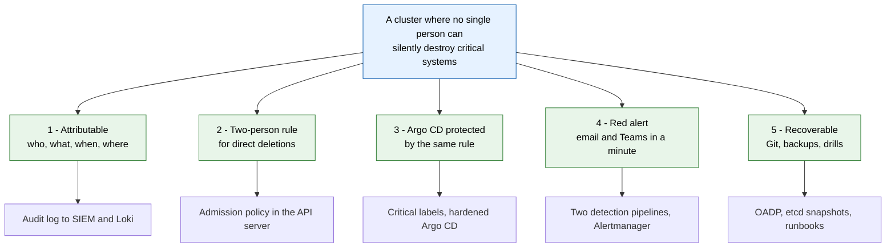

## 4. The key idea: two roads

The organisation already has a good approval process: **Git**. Every change to the cluster's configuration is proposed as a *pull request* in GitHub, reviewed by two people (including the owning team) and checked by automated tests before it is merged. Argo CD then applies the merged change to the cluster. Every step is recorded in GitHub.

So there are two roads to change something on the cluster:

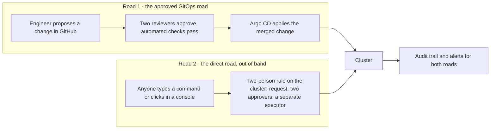

- **Road 1 is already approved by two people in GitHub.** Asking for a second approval on the cluster would be redundant and would slow every release. So changes arriving through this road are trusted, and deletions of critical items are still announced to the team so they can be matched to the pull request.
- **Road 2 bypasses Git.** Commands typed by hand, clicks in the web console, clicks in the Argo CD web interface, or any other tool. On critical items, this road requires the two-person rule, enforced by the cluster itself. It applies to everyone, including full administrators.

This keeps day-to-day delivery fast and puts friction only where the risk is: undocumented, unreviewed changes to critical systems.

## 5. The same night, replayed with the protection in place

The engineer presses Enter in the wrong window again.

1. **The cluster refuses.** Within milliseconds the command returns `GUARDRAIL DENIED`, with an explanation of how to request an approved deletion. Nothing is deleted.
2. **The team is told.** Within about a minute a red message appears in the platform team's Teams channel and in the on-call mailbox: who tried, what they tried to delete, and a link to the runbook.
3. **The evidence is kept.** The attempt, including the exact request, is recorded in the audit trail and forwarded to the security team's log system (the SIEM), where it cannot be edited.
4. **If the deletion was actually needed**, the engineer files a request; two approvers from the approvers group review it; a third person executes it. The deletion succeeds, a red alert still fires (because a critical item really was removed), and the audit trail shows all four people and the change ticket.
5. **If someone tries to switch off the protection first**, that is denied as well, and it raises the highest-priority security alert.
6. **If everything else fails**, Argo CD and its configuration are restored from Git and from backups taken every six hours, following a rehearsed procedure (target: about 30 minutes).

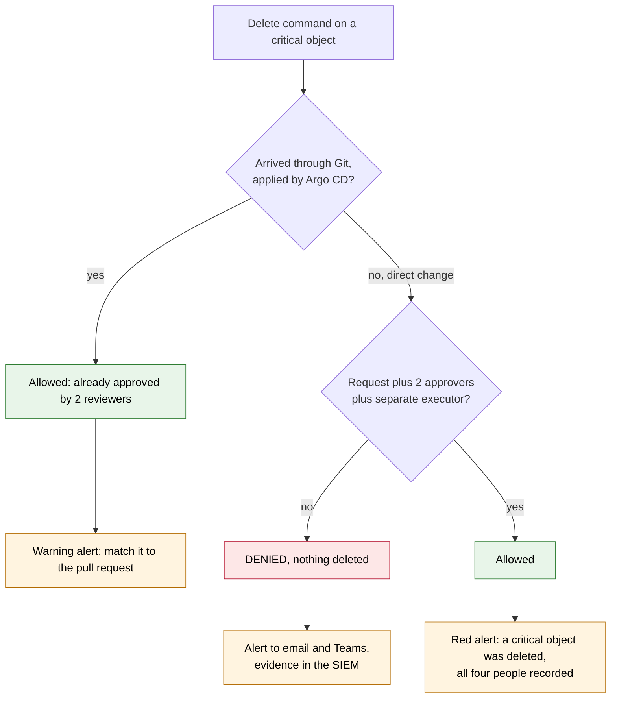

## 6. What it costs, and what it does not

| Item | Answer |
|---|---|
| New software to buy | **None.** Everything uses Red Hat-supported components already included with OpenShift (the built-in admission policy engine, OpenShift Logging, Loki, the monitoring stack, OpenShift GitOps, OADP backups). |
| New servers or agents that could fail | **None for the core control.** The protection runs inside the cluster's own API server; there is no extra service that could crash and silently switch it off. |
| Storage | Audit logs grow; we keep 90 days in the cluster and the long-term copy in the existing SIEM. Backup and log buckets are write-once. |
| Engineering effort | About three working days of hands-on work per cluster, spread over three to five weeks of observation windows (see the rollout below). |
| People | At least four named approvers across at least two teams, so two are always available. Approvers are asked only for direct deletions of critical items, which should be rare. |
| Impact on normal releases | **None** for changes that go through Git. |
| Impact on emergency fixes | A documented break-glass procedure exists, needs two custodians, and is always alerted and reviewed afterwards. |

### Safe, reversible rollout

The protection is switched on in four steps, each a small reviewed change that can be reverted:

| Phase | What happens | Minimum duration | Risk to production |
|---|---|---|---|
| 1 · Observe | Everything is recorded and alerted as "would have been denied"; nothing is blocked | 1 week | none |
| 2 · Warn | Users see a warning on every action that will be blocked later; nothing is blocked | 1 week | none |
| 3 · Enforce | Direct deletions of critical items are blocked unless approved by two people | from here on | low, after two weeks of evidence |
| 4 · Git only | Direct *edits* of critical items are blocked too; all changes must come through Git | 2 weeks after phase 3 | low, optional but recommended |

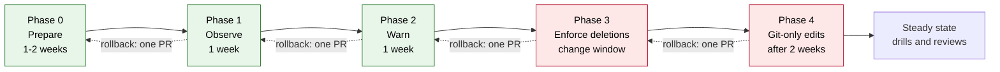

The protection's own configuration is locked from day one, so it cannot be switched off during the rollout.

## 7. What leaders are asked to approve

**Decisions**

1. Adopt the trust model: Git plus two reviewers is the approved road; direct changes to critical items need the two-person rule on the cluster.
2. Nominate approvers (at least four people across at least two teams) and two break-glass custodians.
3. Agree that no person holds unrestricted administrator rights at rest. Administrators get time-limited, slightly reduced rights (they cannot impersonate other identities or grant themselves more power).
4. Fund the rollout effort (about three engineer-days per cluster) and a quarterly restore drill.
5. Accept the residual risks listed below.

**Residual risks (what no design can fully remove)**

| Risk | Why it remains | How it is reduced |
|---|---|---|
| Three people collude | A two-person rule assumes most people are honest | every step is attributed and alerted; approvers are recertified quarterly |
| Someone gains access to the machines underneath the cluster | Protection lives in the API; physical/node access is below it | no SSH keys, node access is alerted, the installer credential is vaulted |
| The GitHub accounts of two reviewers are compromised | Git is the approved road | signed commits, no bypass of the review rules, every Git deletion of a critical item is announced and must match a pull request |
| Email or Teams is down | Alerts depend on them | every alert also goes to the default on-call route; a delivery-failure alert exists; a monthly synthetic alert is tested |

**How we will know it works (KPIs)**

| Measure | Target |
|---|---|
| Critical deletions without two approvals | 0 |
| Time from event to alert (95% of cases) | 60 seconds or less |
| Time to acknowledge a red alert | 5 minutes or less |
| Break-glass uses per quarter | 0 (each one gets a post-incident review) |
| Restore drills that succeed | 100 % |

**Compliance value.** The solution directly evidences segregation of duties, privileged access control, logging and monitoring, change management and backup controls in ISO/IEC 27001:2022 (A.5.3, A.5.15, A.8.2, A.8.15, A.8.16, A.8.13, A.8.32), SOC 2 (CC6, CC7, CC8, A1.2), NIST SP 800-53 (AC-3(2) dual authorisation, AC-5, AU-2/3/6/9/11, CM-3/5, CP-9/10, IR-4/6, SI-4), the CIS OpenShift Benchmark and PCI DSS 4.0 (7.2, 8.x, 10.2 to 10.7). Details: `docs/12`.

**Assurance.** Two independent reviews examined the design and found 59 issues; all were fixed and are recorded in `docs/16`. About 70 automated and 45 manual test cases prove each rule, and every change to the protection itself goes through the same two-reviewer Git process.

---

# Part 2 · The guided tour, for technical teams

## 8. The architecture in one picture

The solution is eight independent layers. Each one still helps if another fails.

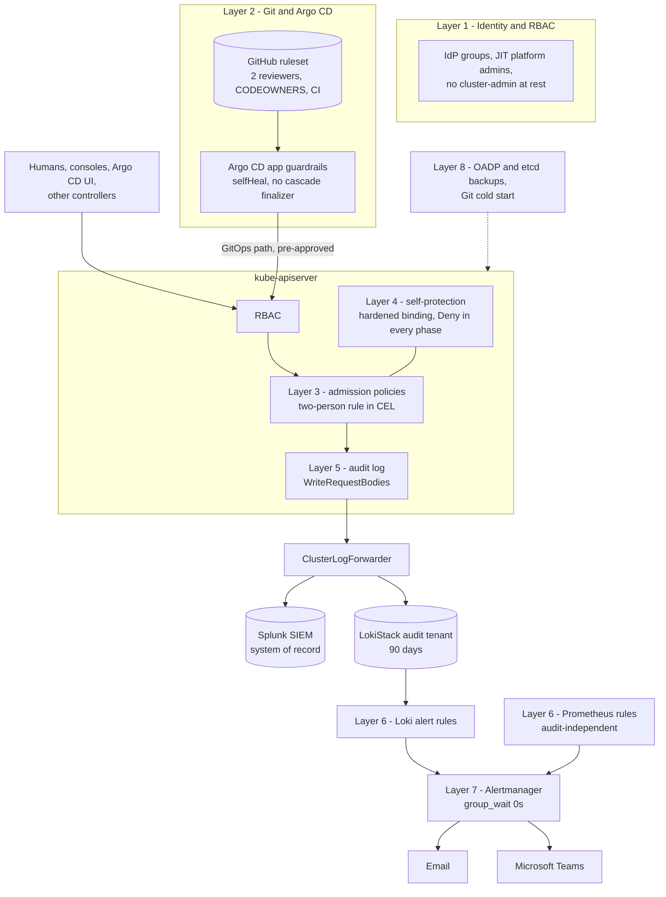

### The life of one API request

Every write to the cluster passes the same checkpoints inside kube-apiserver. The guardrail sits at admission, after RBAC and before anything is stored, which is why it applies to cluster-admin too and cannot be bypassed by stopping a pod.

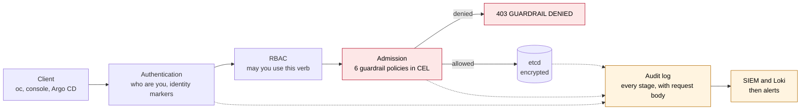

### Layers at a glance

| Layer | Problem it solves | Mechanism | Folder |
|---|---|---|---|
| 1 Identity and RBAC | Too many people with unlimited power; shared accounts | IdP groups, JIT admins without `impersonate`/`escalate`/`bind`, least-privilege roles | `manifests/00-namespaces-and-groups`, `manifests/02-rbac` |
| 2 Git and Argo CD | Unreviewed changes; Argo CD deleting what it manages | ruleset, CODEOWNERS, CI; hardened ArgoCD CR, fenced AppProject, no cascade finalizer | `.github`, `manifests/04-argocd` |
| 3 Admission policy | cluster-admin can delete anything with one command | `ValidatingAdmissionPolicy` enforcing request + 2 approvers + executor | `manifests/03-guardrails` |
| 4 Self-protection | Someone disables the control first | policy objects are critical and GitOps-only in every phase; self-heal; P1 alert | `manifests/03-guardrails` |
| 5 Audit | "Who did it?" has no reliable answer | API-server audit with request bodies, forwarded to SIEM and Loki | `manifests/01-audit` |
| 6 Detection | Nobody notices | 25 audit-log alerts + 16 metrics alerts that work even if audit forwarding is blinded | `manifests/05-alerting`, `manifests/07-hardening-extras` |
| 7 Notification | Alerts sit unread in a console | Alertmanager to email and Teams with no grouping delay; delivery failure alerted | `manifests/05-alerting` |
| 8 Recovery | Damage done anyway | OADP schedules, etcd snapshots, Git cold start, rehearsed restore | `manifests/06-backup`, `manifests/07-hardening-extras` |

## 9. Key concepts, in plain terms

| Term | Meaning here |
|---|---|
| **Critical resource** | An object whose loss would break the platform or its protection. Marked with the label `guardrails.example.com/critical: "true"` in Git, or protected by name (e.g. the `openshift-gitops` namespaces, Argo CD CRDs, anything named `guardrails-*`). Full list: `AGENTS.md` facts table. |
| **Admission** | The step inside kube-apiserver after authentication and RBAC, and before anything is stored in etcd. A denial here means the change never happens. |
| **ValidatingAdmissionPolicy (VAP)** | Kubernetes' built-in admission rules written in CEL (a small expression language), evaluated inside kube-apiserver. No webhook, no extra pod. GA since Kubernetes 1.30; OCP 4.21 ships 1.34. |
| **Binding** | Attaches a policy to a set of objects and says what to do on failure: `Audit` (record), `Warn` (tell the caller), `Deny` (block). The rollout phases change only these actions. |
| **On-object approvals** | The request and approvals are annotations on the object being deleted, so the evidence travels with it and appears in its own audit events. |
| **GitOps path** | A change merged in Git and applied by the Argo CD application or ApplicationSet controller. Pre-approved; exempt from the cluster-side rule. |
| **Out-of-band** | Every other way of changing the cluster, including the Argo CD web UI and CLI (which act as `argocd-server`, not as the Git-applying controller). |
| **Break-glass** | A service account with elevated rights for emergencies. Its token can only be minted by two custodians, and every use is alerted. |

## 10. Layer 3 in depth: the two-person rule

### What it solves

RBAC cannot restrict `cluster-admin`, and someone must always be able to delete things. The only place that can say "yes, but not alone" to *every* identity is admission. This layer enforces separation of duties inside kube-apiserver.

### How a legitimate out-of-band deletion works

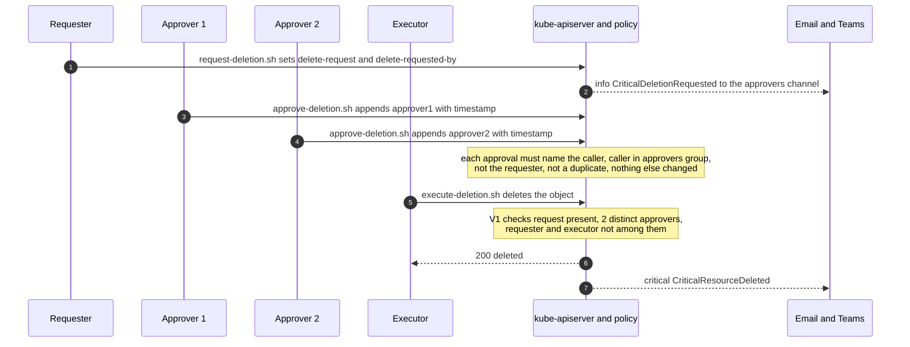

```bash
scripts/request-deletion.sh argocd openshift-gitops -n openshift-gitops "CHG12345: decommission"   # requester
scripts/approve-deletion.sh argocd openshift-gitops -n openshift-gitops                            # approver 1, own login
scripts/approve-deletion.sh argocd openshift-gitops -n openshift-gitops                            # approver 2, own login
scripts/execute-deletion.sh argocd openshift-gitops -n openshift-gitops                            # executor, a third person
```

### The four rules (all evaluated on the state *before* the request)

| Rule | When | Stops |
|---|---|---|
| **V1** | DELETE | any deletion of a critical object without request + ≥ 2 distinct approvers, none of them the requester or the executor |
| **V2** | UPDATE | "remove the critical label, then delete" |
| **V3** | UPDATE | forged, duplicate or third-party approvals, approving your own request, hiding a spec change inside an approval |
| **V4** | UPDATE | opening a request in someone else's name, or changing the reason after approvals were given |

Approvals expire after 4 hours and an open request after 24 hours. CEL has no clock, so a small CronJob (the *reaper*) removes stale entries every 10 minutes; the policy lets it *remove* entries only.

### Files

| File | What it solves | How |
|---|---|---|
| `manifests/03-guardrails/crd-guardrailconfig.yaml` | Policies need tunable parameters without editing CEL | defines the cluster-scoped `GuardrailConfig` type (`minApprovers`, groups, exempt identities, GitOps controllers, TTL, identity markers) with schema validation (`minApprovers` ≥ 2) |
| `manifests/03-guardrails/guardrailconfig-default.yaml` | One source of truth for every policy | the single `GuardrailConfig/default` all policies read through `paramRef` |
| `manifests/03-guardrails/vap-critical-delete.yaml` | The two-person rule itself | CEL `variables` compute "is critical", parse the annotations, derive `deletionApproved`; `validations` V1 to V4; `auditAnnotations.decision` records every decision for the alerts |
| `manifests/03-guardrails/vap-critical-delete-bindings.yaml` | Apply the rule cheaply and fail safe | binding `-labelled` selects labelled objects (matches old *or* new object, so removing the label still matches) and fails closed; binding `-named` covers name-protected kinds and allows if the config is missing so OLM and namespace lifecycle never wedge |
| `manifests/03-guardrails/vap-critical-label-control.yaml` | A tenant labels their own object critical to disrupt the platform team | only trusted GitOps identities, break-glass or approvers may *add* the label |
| `manifests/03-guardrails/vap-deletion-tracker.yaml` | Approvers not knowing a request waits for them; nobody knowing how many approvals remain | records the state of every workflow step (have, need, remaining, expiries) in the audit log without ever denying; Loki rules turn it into notifications and reminders for the approvers' email list and Teams channel (`docs/19`) |
| `manifests/03-guardrails/reaper-cronjob.yaml` | Old approvals or old requests being reused later | CronJob, ServiceAccount and narrow RBAC that remove expired, future-dated or invalid approvals every 10 minutes |
| `scripts/lib.sh` | Everyone must write the annotations exactly right | shared annotation contract, identity checks and safe reads used by the four workflow scripts |
| `scripts/status-deletion.sh`, `list-pending-deletions.sh` | "Where does my request stand?" | read-only views: approvals so far, remaining, request and approval expiry, every open request on the cluster |
| `scripts/request-deletion.sh`, `approve-deletion.sh`, `execute-deletion.sh`, `cancel-deletion.sh` | Humans making mistakes with raw `oc annotate` | guided steps that use the caller's own identity, show the state, ask for confirmation (`--yes` to skip); execute refuses Tier-B kinds and prints the audit query afterwards |

**What your team does:** approvers run `approve-deletion.sh` once on a scratch object during phase 1; requesters and executors learn the four commands (`.claude/skills/guardrail-delete/SKILL.md`, `docs/09` §Request).

## 11. The trust model and identity markers (how the policy knows who is really asking)

### What it solves

If Git-driven changes had to be approved twice, releases would stall and Git would stop being the source of truth. But if we trust "Argo CD" generally, anyone clicking in the Argo CD UI would bypass the rule, and anyone who can impersonate the Argo CD controller would too.

### How

- `GuardrailConfig.spec.gitopsControllers` lists only the two identities that apply **merged Git state**: the Argo CD application-controller and the ApplicationSet controller. They are exempt; their critical deletions raise `GitOpsCriticalDeletionApplied` (warning) so on-call can match them to a pull request.
- `argocd-server` (UI/CLI) is deliberately **not** exempt. It is a *trusted mutator* (`gitopsServiceAccounts`) for ordinary updates only.
- **Impersonation** (`oc --as`) used to be a one-command bypass: a cluster-admin could pretend to be an approver or the exempt controller. Now:
  - humans hold `guardrails-platform-admin` (everything except `impersonate`, `escalate`, `bind`) plus `guardrails-impersonator` (impersonate users, groups, service accounts, but never `userextras`);
  - a real session carries a marker in `userInfo.extra` (humans: `scopes.authorization.openshift.io`; service accounts with bound tokens: `authentication.kubernetes.io/credential-id`) that an impersonated session cannot forge;
  - exemptions and approver status count only when the marker is present;
  - `guardrails-impersonation-dry-run-only` denies any impersonated write unless it is `--dry-run=server`. Client-side dry-runs never reach the server, so they are unaffected. Reads and `oc auth can-i --as` keep working.

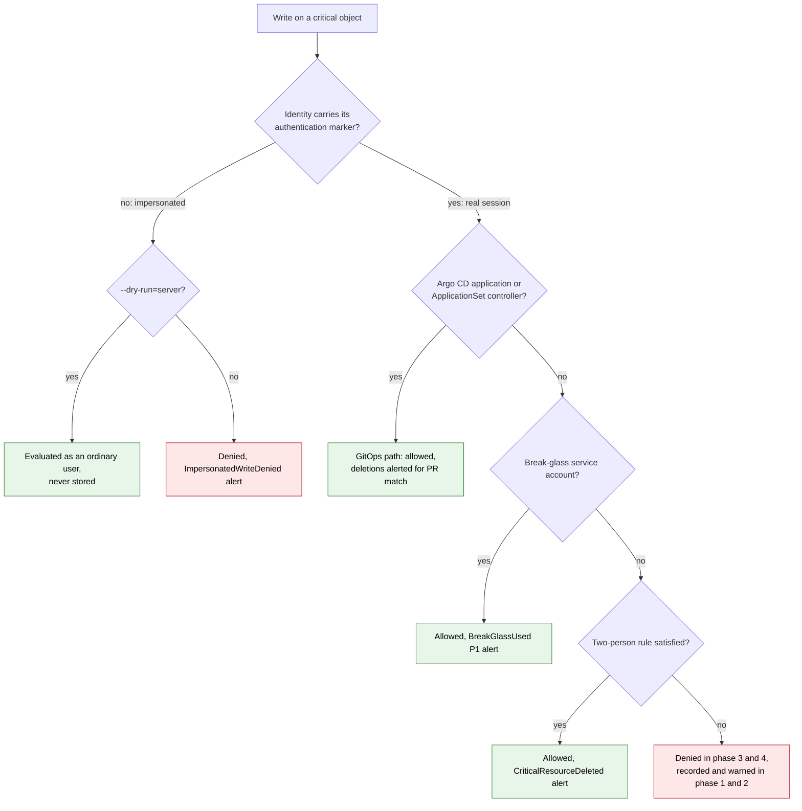

### Files

| File | What it solves | How |
|---|---|---|
| `manifests/03-guardrails/vap-impersonation-dry-run-only.yaml` | `--as` used to forge approvals or exemptions | denies non-dry-run writes from identities missing their authentication marker; skips access reviews and system components; stamps `impersonated-write` in the audit event |
| `manifests/02-rbac/platform-admin.yaml` | cluster-admin can impersonate `userextras` and forge markers | defines `guardrails-platform-admin` and `guardrails-impersonator` and binds the latter to `platform-admins` |
| `docs/17-impersonation-control.md` | Reviewers need the reasoning | behaviour matrix, corner cases, verification |

**What your team does:** stop granting `cluster-admin` to people; use JIT membership of `platform-admins`. If your IdP is an external OIDC provider, confirm the human marker key on a real session (`oc auth whoami -o yaml`) and set `humanAuthExtraKey` accordingly.

## 12. Layer 1: identity and RBAC

### What it solves

Standing `cluster-admin`, shared `kubeadmin` passwords and broad roles make every other control weaker: a powerful account is the easiest thing to steal or misuse.

### How

- People are in **IdP groups**, never bound individually: `platform-admins` (JIT, empty at rest), `gitops-deletion-requesters`, `gitops-deletion-approvers`, `gitops-operators`, `auditors`, `breakglass-custodians`.
- `kubeadmin` is removed; the installer `system:admin` kubeconfig is vaulted under dual control; any use is alerted.
- Roles grant exactly what the workflow needs:
  - **Tier A** (Argo CD CRs, `GuardrailConfig`, policies, `guardrails-*` RBAC, groups, APIServer/OAuth, logging/alerting/backup CRs, named CronJobs/ConfigMaps): approvers and requesters may patch them *by name* (`resourceNames`) and only in the platform namespaces, so the admission policy can check the content.
  - **Tier B** (namespaces, CRDs, OLM objects, Secrets, ServiceAccounts): no human patch or delete at all. Changing them is an escalation primitive, so the only paths are Git or break-glass.

### Files

| File | What it solves | How |
|---|---|---|
| `manifests/00-namespaces-and-groups/groups.yaml` | Who belongs to which role | bootstrap `Group` objects (synced from the IdP in production) |
| `manifests/00-namespaces-and-groups/namespace-guardrails-system.yaml` | A home for the reaper and break-glass | the `guardrails-system` namespace, labelled critical |
| `manifests/00-namespaces-and-groups/networkpolicy-guardrails-system.yaml` | Lateral movement into the control namespace | default-deny ingress, egress only to the API server and DNS |
| `manifests/02-rbac/clusterroles.yaml` | Least privilege for requesters, approvers, operators, auditors | `ClusterRole`s with `resourceNames` for every cluster-scoped Tier-A object, and bindings to the groups |
| `manifests/02-rbac/rolebindings.yaml` | Namespaced Tier-A objects | `RoleBinding`s in the platform namespaces only |
| `manifests/02-rbac/breakglass.yaml` | Emergencies need power without standing admins | the break-glass ServiceAccount bound to `guardrails-platform-admin`, and a custodian Role that only lets `breakglass-custodians` mint its token |
| `manifests/02-rbac/argocd-rbac-configmap-patch.yaml` | Argo CD users bypassing Git in the UI | reference Argo CD RBAC policy: read-only default, delete/override denied |
| `manifests/07-hardening-extras/oauth-token-config.yaml` | Long-lived login tokens | shorter token lifetime and inactivity timeout |
| `manifests/07-hardening-extras/ldap-group-sync.example.yaml` | Groups drifting from the directory | example LDAP group sync (adapt to your IdP) |

**What your team does:** create the IdP groups (`gitops-deletion-approvers` ≥ 4 people across ≥ 2 teams), remove `kubeadmin` after the IdP is verified, rehearse break-glass (`docs/03`, `docs/09`).

## 13. Layer 2: Git and Argo CD

### What it solves

Argo CD is both the thing to protect and the delivery mechanism. There are three ways it can delete things: Git (a manifest removed), the Argo CD UI/CLI, and deleting an `Application` whose cascade finalizer removes everything it manages.

### How

- **Git**: the `main` branch ruleset requires 2 approvals, code-owner review from both platform and security for sensitive paths, signed commits, linear history, no force-push, and the CI job `validate`, with **no bypass actors**.
- **CI invariants** make weakening impossible to merge by accident: humans in exempt lists, `argocd-server` in `gitopsControllers`, `minApprovers` < 2, `Deny` missing in phase 3/4 or from the hardened binding, a cascade finalizer on the guardrails app, secrets in Git.
- **Argo CD**: SSO through OpenShift OAuth, local `admin` disabled, RBAC denying delete and override, server-side diff; a fenced `AppProject` that may only deploy this repository to the namespaces it renders into; the guardrails app-of-apps with `prune: true` (Git is the truth), `selfHeal: true`, and **no** `resources-finalizer.argocd.argoproj.io`, so deleting the Application never cascades.

### Files

| File | What it solves | How |
|---|---|---|
| `.github/ruleset-main.json`, `.github/RULESET.md` | The Git road must itself be two-person | the exact ruleset to apply with `gh api`, and the click-path |
| `.github/CODEOWNERS` | The wrong team approving a guardrail change | platform and security must both approve guardrail, RBAC, audit, alerting and overlay paths |
| `.github/workflows/policy-ci.yaml` | Broken or weakened manifests merged | yamllint, kustomize build of base and 4 overlays, kubeconform, Python invariants, Mermaid check, stale-HTML check, shellcheck, optional pre-prod server dry-run |
| `manifests/04-argocd/argocd-cr-hardening-patch.yaml` | Argo CD's own weak defaults | SSO, admin disabled, RBAC, server-side diff, resource tracking settings |
| `manifests/04-argocd/appproject-guardrails.yaml` | An Application deploying anything anywhere | pins source repo, destinations and allowed kinds |
| `manifests/04-argocd/application-guardrails.yaml` | The guardrails need an owner that repairs drift | app-of-apps whose `spec.source.path` selects the phase overlay; self-heal; no cascade finalizer; ignores approval annotations |
| `manifests/04-argocd/applicationset-defaults-snippet.yaml` | ApplicationSets deleting apps when a generator changes | `preserveResourcesOnDeletion` and safe defaults to copy |

**What your team does:** apply the ruleset (it is **not yet applied** to the repository), remove cascade finalizers from existing production Applications that must not cascade (`docs/15` D4).

## 14. Layer 4: self-protection

### What it solves

An attacker or an impatient engineer would switch off the control first, then delete.

### How (five layers, in depth)

1. The policies, bindings, `GuardrailConfig`, `guardrails-*` RBAC and approver groups are **critical by name**, so V1 applies to them.
2. The `guardrails-gitops-only-mutation-hardened` binding **denies in every phase** any change to them by anyone other than the GitOps path, trusted mutators and break-glass (humans may still add approval annotations).
3. RBAC lets humans touch them only by name.
4. Argo CD self-heals them within its sync interval (about 3 minutes).
5. Any out-of-band write raises `GuardrailPolicyModified` (P1).

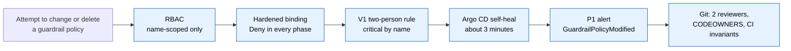

### Files

| File | What it solves | How |
|---|---|---|
| `manifests/03-guardrails/vap-gitops-only-mutation.yaml` | Hand-editing critical objects outside Git | policy plus two bindings: the general one (Audit until phase 4, then Deny) and `-hardened` (Deny always) for the self-protection set |
| `manifests/03-guardrails/vap-rbac-escalation-audit.yaml` | Quiet privilege escalation | never denies; "fails" with `[Warn, Audit]` on bindings to `cluster-admin`/`admin`/`guardrails-*` or changes to privileged groups, which stamps the audit event for `PrivilegedRBACChange` |
| `manifests/07-hardening-extras/prometheusrule-vap-health.yaml` | The policy silently not evaluating | alerts on policy evaluation errors, absence of evaluations, and latency |

Open item: whether your exact build evaluates a VAP against deletion of VAP bindings (residual risk R3) must be confirmed once on pre-prod; layers 2 to 5 protect them either way.

## 15. Layer 5: the audit trail

### What it solves

"Who did it, and what exactly did they send?" must have a complete, tamper-resistant answer.

### How

- The API server audit profile `WriteRequestBodies` records metadata for every request and the full body for every write. Custom rules add detail for sensitive identities.
- etcd encryption (`aesgcm`) protects stored secrets.
- One `ClusterLogForwarder` pipeline sends audit events to **Splunk** (the system of record, WORM storage) and to an in-cluster **LokiStack** audit tenant (90 days) used for alerting.
- Every admission decision is stamped into the audit event (`guardrails-critical-delete` decision annotation, the validation failure annotation), so investigations can filter on it.

### Files

| File | What it solves | How |
|---|---|---|
| `manifests/01-audit/apiserver-audit.yaml` | Default profile does not keep request bodies; secrets readable in etcd | `APIServer/cluster` with `WriteRequestBodies`, custom rules and `encryption.type: aesgcm` |
| `manifests/01-audit/operators.yaml` | Logging components must be installed and pinned | namespaces, OperatorGroups and Subscriptions for OpenShift Logging and the Loki Operator |
| `manifests/01-audit/lokistack.yaml` | Alerts need a queryable audit store | `LokiStack` with the audit tenant, 90-day retention, ruler enabled |
| `manifests/01-audit/loki-s3-secret.example.yaml` | Object storage credentials | template only, excluded from kustomize; the real secret comes from the vault |
| `manifests/01-audit/clusterlogforwarder-audit.yaml` | Logs must leave the cluster and feed alerting | `observability.openshift.io/v1` forwarder: audit input to Splunk HEC and LokiStack |
| `scripts/audit-query.sh` | Investigators should not have to write queries from scratch | prints LogQL and Splunk SPL for "who touched this object", runs `logcli` if present |

**What your team does:** watch control-plane disk use for a week after the profile change; provide the Splunk HEC token and S3 bucket (versioning + Object Lock) from the vault; learn the cookbook in `docs/02`.

## 16. Layers 6 and 7: detection and notification

### What it solves

A blocked deletion that nobody hears about is a missed warning; a successful one that nobody hears about is an outage discovered too late. And an attacker who stops the log forwarder must not also silence the alarms.

### How

- **Pipeline A, audit-based (25 Loki alert rules):** key alerts include `CriticalResourceDeleted` (critical), `GitOpsCriticalDeletionApplied`, `CriticalResourceDeleteDenied`, `CriticalDeleteWouldBeDenied` (phases 1 and 2), `GuardrailPolicyModified`, `AuditProfileChanged`, `PrivilegedRBACChange`, `ImpersonatedWriteDenied`, `PrivilegedIdentityImpersonated`, `PrivilegedTokenMinted`, `BreakGlassUsed`, `KubeadminOrSystemAdminUsed`, `ArgoCDDirectMutation`, `ControlPlaneNodeAccess`.
- **Pipeline B, metrics-based (16 Prometheus rules), independent of audit logs:** Argo CD controller, server or operator missing, GitOps namespace terminating, guardrails app out of sync, audit ingestion stalled, forwarder not ready, reaper failing, Loki ruler down, policy evaluation errors, and **notification delivery failing**.
- **Alertmanager 0.29** routes every alert labelled `guardrail="true"` to email and a Teams channel (native `msteamsv2_configs` with a Teams Workflows webhook), `group_wait: 0s`, repeating every 30 minutes until resolved, and also to the default on-call receiver.

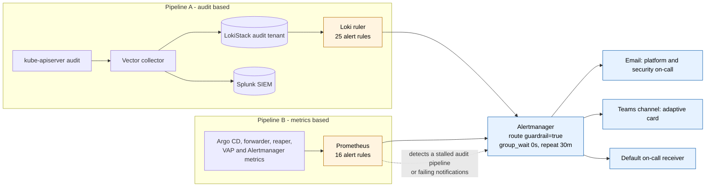

### Files

| File | What it solves | How |
|---|---|---|
| `manifests/05-alerting/loki-alertingrules-audit.yaml` | Detect events in the audit stream | Loki `AlertingRule`s on the audit tenant, keyed on verb, user, object and the policy annotations |
| `manifests/05-alerting/prometheusrule-gitops-health.yaml` | Detection that survives a blinded audit pipeline | metrics rules for Argo CD, namespaces, forwarder, reaper, ruler |
| `manifests/05-alerting/prometheusrule-notification-health.yaml` | Alerts that are never delivered | alerts on Alertmanager notification failures and invalid config |
| `manifests/05-alerting/alertmanager-main.yaml` | Get alerts to people in seconds | platform Alertmanager config with email and Teams receivers; secret, excluded from kustomize, rendered from the vault |
| `manifests/05-alerting/alertmanagerconfig-uwm-alternative.yaml` | Organisations that may not edit the platform Alertmanager | equivalent `AlertmanagerConfig` for user-workload monitoring |

**What your team does:** create the Teams Workflows webhook and SMTP credentials (`docs/06`), install the Alertmanager secret from the vault, run a synthetic alert monthly, and have on-call acknowledge one end to end before phase 3.

## 17. Layer 8: recovery

### What it solves

Even with every control, a legitimate but wrong deletion, a bug or a disaster can happen. Recovery must be fast and proven.

### How

| What | Recovery point | Recovery time | Path |
|---|---|---|---|
| Argo CD and all Applications | 6 h (OADP) / last commit (Git) | about 30 min | `docs/09` "Restore Argo CD" |
| One deleted critical object | last commit | about 5 min | re-sync from Git, or a targeted Velero restore |
| Guardrail objects | last commit | about 3 min (self-heal) | Argo CD, or `oc apply -k` of the phase overlay |
| Audit evidence | 0 (streamed) | n/a | SIEM |

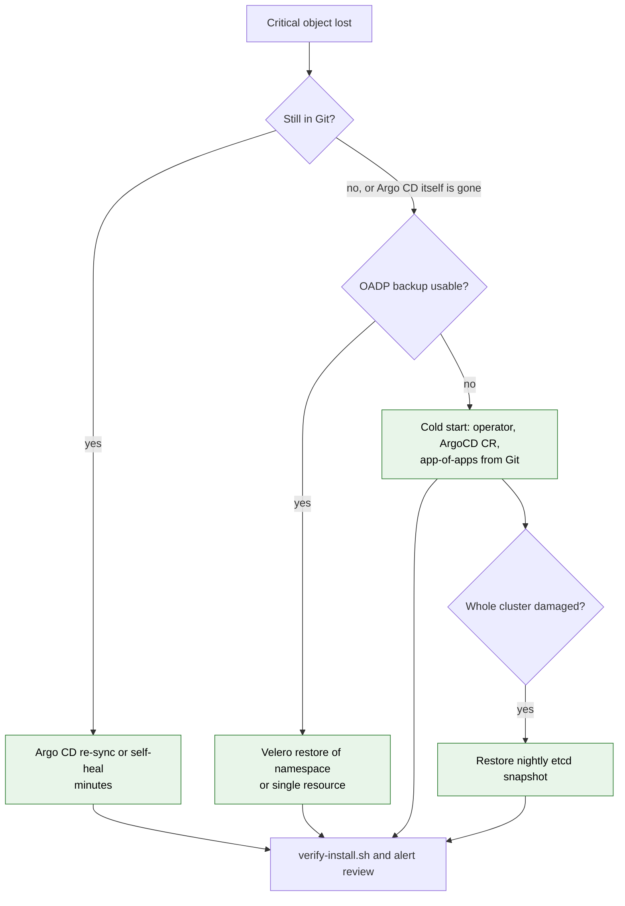

### Files

| File | What it solves | How |
|---|---|---|
| `manifests/06-backup/oadp-dpa.yaml` | Backups need an engine and a location | OADP operator install and `DataProtectionApplication` with one object-locked bucket |
| `manifests/06-backup/schedule-gitops.yaml` | Regular, retained backups | `gitops-6h` (namespaces, 30 days) and `guardrails-daily` (critical cluster-scoped objects, 90 days) |
| `manifests/07-hardening-extras/etcd-backup-cronjob.yaml` | Whole-cluster disaster | nightly etcd snapshot CronJob |
| `manifests/07-hardening-extras/machineconfig-control-plane-ssh.example.yaml` | Node-level bypass (R2) | example that removes SSH keys from control-plane nodes |

**What your team does:** a quarterly restore drill into a scratch namespace, timed and recorded (`docs/07`).

## 18. How it is rolled out, tested and operated

### Rollout mechanics

The repository is **one Argo CD Application**. Its `spec.source.path` points at one of four overlays; the overlays differ only in the `validationActions` of the policy bindings. Moving to the next phase is a two-reviewer pull request that changes that path.

| File | Role |
|---|---|
| `manifests/base/kustomization.yaml` | renders everything once (91 objects), in dependency order |
| `manifests/overlays/phase1-audit/` | deletion, label-control, gitops-only, impersonation bindings `[Audit]`; hardened binding `[Deny, Audit]` |
| `manifests/overlays/phase2-warn/` | the same bindings `[Warn, Audit]` |
| `manifests/overlays/phase3-enforce/` | deletion, label-control, impersonation `[Deny, Audit]`; gitops-only still `[Audit]` |
| `manifests/overlays/phase4-gitops-only/` | gitops-only `[Deny, Audit]` too |

### Testing and proof

| Tool | What it proves |
|---|---|
| `scripts/verify-install.sh` | every layer is healthy: policies ready, bindings present, config present, forwarder ready, ruler loaded, Alertmanager config valid, backups scheduled |
| `scripts/test-guardrails.sh` | 76 allow/deny expectations in a scratch namespace; reads each binding's live action so it is correct in every phase; writes an evidence log |
| `docs/14-manual-test-guide.md` | T-numbered scenarios with the exact command and expected output, for sign-off |
| `docs/16-production-readiness-review.md` | 59 audit findings with fixes, and the control-to-test traceability matrix |
| `scripts/check-mermaid.mjs`, `scripts/build-html-docs.mjs` | diagrams render on GitHub; the published site matches the Markdown |

### Who does what

| Role | Responsibilities |
|---|---|
| Leadership | approve the trust model, nominate approvers and custodians, review KPIs quarterly |
| Platform engineering | implement (`docs/15`), own the repository, run phase gates, restore drills, upgrades plus `test-guardrails.sh` |
| Security | co-own CODEOWNERS paths, Splunk searches, recertify approvers and custodians, triage security alerts |
| Approvers | review out-of-band deletion requests against the change ticket; never approve their own |
| On-call | respond to red alerts with `docs/09` and the `/guardrail-incident` skill |
| Application teams | change the cluster through Git; use the workflow for direct critical deletions |
| Auditors | read-only access to audit data; evidence from `docs/12` and the test logs |

### Operating rhythm

Monthly synthetic alert; quarterly access recertification, restore drill and residual-risk review; `test-guardrails.sh` after every OpenShift, Logging or GitOps upgrade; a post-incident review for every break-glass use (`docs/12`).

## 19. The rest of the repository, and where to go next

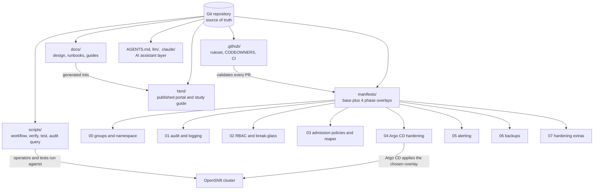

| Path | Purpose |
|---|---|
| `README.md` | requirements, architecture, workflow, quick start |
| `docs/00-placeholders.md` | every organisation-specific value (`guardrails.example.com`, `example-org`, `REPLACE_*`) to replace before the first apply |
| `docs/01-threat-model.md` | assets, attack and accident scenarios, residual-risk register R1 to R8 |
| `docs/02` to `docs/12` | the detailed design per layer, runbooks, rollout, testing, operations and compliance |
| `docs/13-solution-justification.md` | the argument for a review board, with rejected alternatives |
| `docs/15-implementation-guide.md` | the step-by-step build, Parts A to G, with a tracking table |
| `docs/17-impersonation-control.md` | why `--as` is limited to reads and dry-runs |
| `docs/19-deletion-approval-lifecycle.md` | how a deletion is prevented, how approvers are notified, how approvals are counted and how long requests live |
| `AGENTS.md`, `CLAUDE.md`, `llms.txt`, `llm/`, `.claude/` | a compact operating guide, skills and agents so AI assistants can help without weakening the controls |
| `html/` | this published site: portal, study guide and the generated documents |

**Next step for leaders:** approve the decisions in chapter 7.
**Next step for engineers:** start `docs/15-implementation-guide.md` at Part A, and use `html/study-guide.html` to learn the design in depth.
