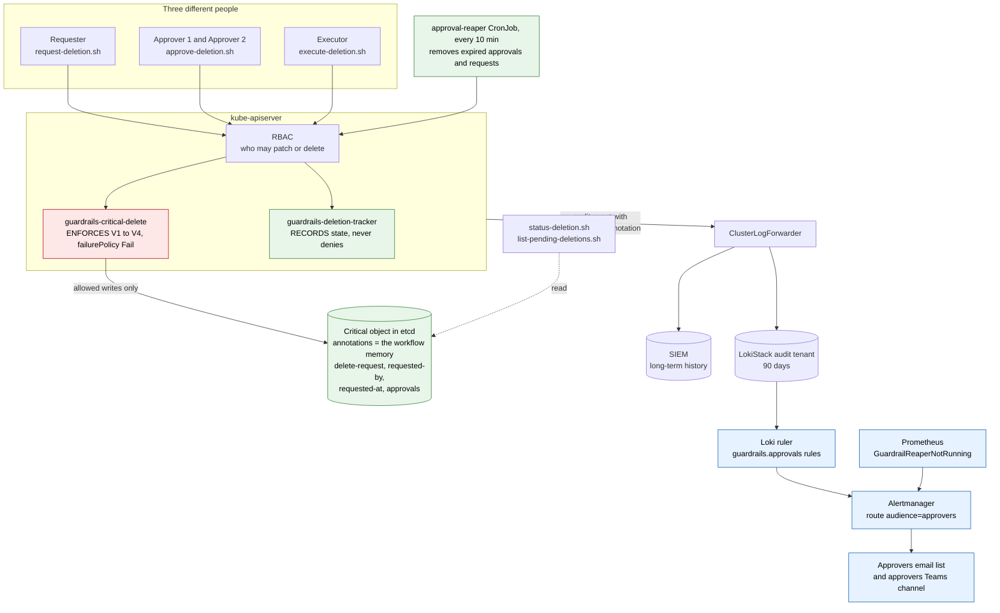
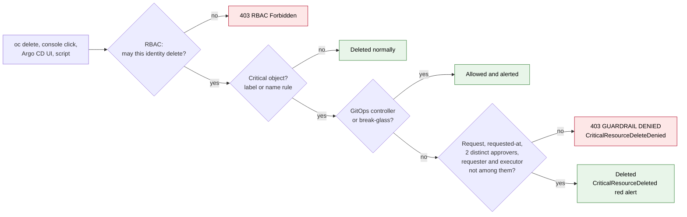
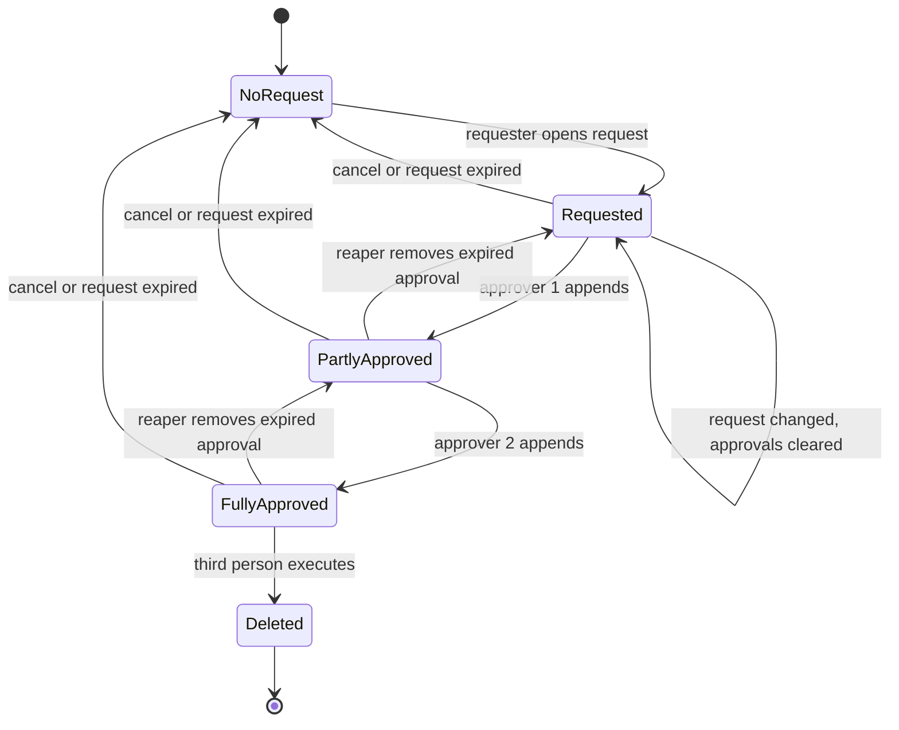
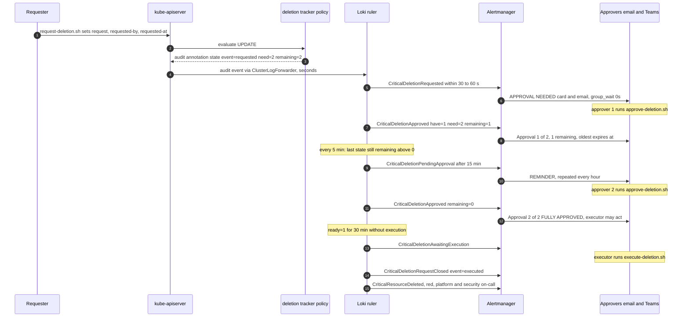

# 19 · Deletion approval lifecycle: prevention, notification, memory and time

This document follows one deletion request from beginning to end and answers four questions precisely, with the code that is responsible for each answer:

| Question | Short answer | Responsible code |
|---|---|---|
| **How is an accidental deletion of a critical resource prevented?** | kube-apiserver refuses every out-of-band DELETE of a critical object unless the object itself carries a request, two valid approvals from two other people, and the deleter is a third person. It applies to cluster-admin too. | `manifests/03-guardrails/vap-critical-delete.yaml` rule **V1** (+ V2 to V4) |
| **How are the approvers notified that they must approve?** | Every change to the request is stamped into the audit log by a recording-only policy; Loki alert rules turn it into a message to the approvers' email list and Teams channel within about a minute, with hourly reminders while the request is pending. | `vap-deletion-tracker.yaml` → `05-alerting/loki-alertingrules-audit.yaml` groups `guardrails.approvals*` → `alertmanager-main.yaml` receiver `guardrail-approvers` |
| **How does the system remember how many have approved and how many remain?** | The state lives **on the object** as annotations (request, requester, request time, list of `user\|time` approvals). The policy recounts distinct valid approvers on every request; the tracker publishes `have`, `need`, `remaining`; `status-deletion.sh` and `list-pending-deletions.sh` show it. | annotations `guardrails.example.com/delete-*`; CEL variables `oldApprovers`, `deletionApproved`; tracker `have/need/remaining`; `scripts/lib.sh` `show_state` |
| **How long does the system remember an unfinished process?** | Each approval is valid for `approvalTTL` (4 h); an open request for `requestTTL` (24 h, measured from `delete-requested-at`). A CronJob removes what is older every 10 minutes. The history is kept in the audit trail (90 days in Loki, the SIEM's retention beyond). | `GuardrailConfig` `approvalTTL` / `requestTTL`; `reaper-cronjob.yaml` |

It also records the defects and gaps found while writing this document, and the fixes now in the repository (§9).

---

## 1. Architecture



Two policies look at the same requests with different jobs:

| Policy | Job | Failure behaviour | Why separate |
|---|---|---|---|
| `guardrails-critical-delete` | **decide**: allow or deny | `failurePolicy: Fail` (an evaluation error denies) | a security control must fail closed |
| `guardrails-deletion-tracker` | **record**: write the resulting state into the audit event | `failurePolicy: Ignore`, no validations, binding `[Audit]` in every phase | timestamp arithmetic can error on odd input; that must never block a legitimate approval or deletion |

## 2. How accidental deletion is prevented

### 2.1 The layers an accident has to get through



| Accident | What stops it | Where |
|---|---|---|
| `oc delete argocd openshift-gitops` in the wrong terminal | V1: no request, no approvals → 403 | `vap-critical-delete.yaml` V1 |
| `oc delete cm -l guardrails.example.com/critical=true` (by selector) | a `deletecollection` is evaluated as one DELETE per object; each is denied | same |
| "Remove the label first, then delete" | V2: removing the critical label needs the same approvals as a deletion | V2 |
| Deleting a whole namespace that contains a critical object | the namespace controller's per-object deletes are denied (it is not exempt); the platform namespaces themselves are critical by name | V1, `nameCritical` |
| A reviewer approves the wrong object | the approval is bound to that object only (on-object annotation) and expires after `approvalTTL` | data model §3 |
| The executor types the wrong name | `execute-deletion.sh` requires typing the resource name; the policy checks the approvals of *that* object | `scripts/execute-deletion.sh` |
| Approvals collected long ago are used today | the reaper removes approvals older than 4 h and requests older than 24 h | `reaper-cronjob.yaml` |
| Someone edits the reason after the approvals were given | V4: any change to request, requester or request time requires the approvals to be cleared in the same write | V4 |
| Argo CD UI "Delete" | `argocd-server` is not a GitOps controller; the workflow applies | `GuardrailConfig.gitopsControllers` |
| A merged PR removed the manifest | pre-approved GitOps path (two reviewers in GitHub); the deletion is announced as `GitOpsCriticalDeletionApplied` | docs/05, docs/08 |

In phase 1 and 2 the same evaluation runs but only records (`CriticalDeleteWouldBeDenied`) or warns; enforcement starts in phase 3 (docs/10).

### 2.2 The rule that decides (V1)

```yaml
# manifests/03-guardrails/vap-critical-delete.yaml
- name: deletionApproved
  expression: >-
    variables.oldRequestedBy != '' && variables.oldRequest != '' && variables.oldRequestedAt != ''
    && variables.oldApprovers.size() >= params.spec.minApprovers
    && variables.oldApproversDistinct
    && !(variables.oldRequestedBy in variables.oldApprovers)
    && (params.spec.executorMayBeApprover || !(request.userInfo.username in variables.oldApprovers))
validations:
  # V1 - DELETE needs the two-person rule satisfied
  - expression: >-
      !variables.isCritical || variables.isExempt || request.operation != 'DELETE' || variables.deletionApproved
      || variables.isOlmCsvReplacement
```

Everything is read from `oldObject`, the stored object **before** the request. A DELETE request cannot carry its own approvals; they must already be on the stored object, where each one was admitted separately under V3.

## 3. The memory: where the workflow state lives

### 3.1 Data model

The state of a deletion request is four annotations on the object being deleted:

| Annotation (`guardrails.example.com/`) | Written by | Format | Enforced by |
|---|---|---|---|
| `delete-request` | requester | `"<change-ticket>: <reason>"` | V4: non-empty, only by its author |
| `delete-requested-by` | requester | the requester's own username | V4: must equal `request.userInfo.username`; author in requester or approver groups |
| `delete-requested-at` | requester | RFC3339 UTC, `2026-09-19T08:00:00Z` | V4: must match the RFC3339 pattern; part of the request, so changing it needs approvals cleared |
| `delete-approvals` | each approver, one entry at a time | `user\|RFC3339Z,user\|RFC3339Z` | V3: exactly one appended entry naming the caller, caller in approver group, not the requester, not a duplicate, nothing else changed |

Why on the object and not in a separate "approval ticket" resource:

- **No extra component.** A CRD-based ticket would need a controller or a multi-parameter lookup; VAP `paramRef.selector` validates against *every* matching parameter, which makes "the matching ticket" unreliable.
- **The evidence travels with the object.** Every approval is an audited write to that object, so `audit-query.sh <name>` shows the whole history.
- **Self-cleaning.** When the object is deleted, its approvals are deleted with it. Nothing can be reused for another object.

### 3.2 The object at each step

```yaml
# 1. after request-deletion.sh (requester alice)
metadata:
  labels:      { guardrails.example.com/critical: "true" }
  annotations:
    guardrails.example.com/delete-request:      "CHG0012345: decommission old instance"
    guardrails.example.com/delete-requested-by: "alice@example.com"
    guardrails.example.com/delete-requested-at: "2026-09-19T08:00:00Z"
# 2. after approver bob
    guardrails.example.com/delete-approvals:    "bob@example.com|2026-09-19T08:05:12Z"
# 3. after approver carol: 2 of 2, ready for a third person to execute
    guardrails.example.com/delete-approvals:    "bob@example.com|2026-09-19T08:05:12Z,carol@example.com|2026-09-19T09:40:03Z"
# 4. executor dave deletes: the object and these annotations are gone; the audit trail keeps every step
```

### 3.3 State machine



Every arrow is one audited write to the object. The tracker names each one: `requested`, `approved`, `expired`, `approvals-cleared`, `cancelled`, `request-expired`, `executed`.

### 3.4 Current state versus history

| What | Where | How long | Read with |
|---|---|---|---|
| Current state of an open request | annotations in etcd (encrypted) | until executed, cancelled or expired | `scripts/status-deletion.sh`, `scripts/list-pending-deletions.sh` |
| Every step, with actor, time, request body and policy decision | API-server audit log → Loki audit tenant | 90 days | `scripts/audit-query.sh <name>`, LogQL below |
| Same, long term | SIEM (Splunk), WORM | your SIEM retention (typically ≥ 1 year) | SPL from `audit-query.sh` |
| Structured state per step (`have`, `need`, `remaining`, expiries) | audit annotation `guardrails-deletion-tracker/state` | as the audit log | LogQL below |

## 4. Counting: how approvals are counted, and what "remaining" means

### 4.1 In the enforcing policy (what decides)

```yaml
- name: oldApprovals          # "bob|t1,carol|t2" -> ["bob|t1", "carol|t2"]
  expression: "variables.oldApprovalsRaw == '' ? [] : variables.oldApprovalsRaw.split(',')"
- name: oldApprovers          # -> ["bob", "carol"]
  expression: "variables.oldApprovals.map(e, e.split('|')[0])"
- name: oldApproversDistinct  # nobody counted twice, at most 32 entries
  expression: "variables.oldApprovers.size() <= 32 && variables.oldApprovers.all(u, variables.oldApprovers.filter(x, x == u).size() == 1)"
```

`deletionApproved` then requires `size() >= minApprovers`, all distinct, the requester not among them and the executor not among them. The count is recomputed from the stored annotation on **every** request. Nothing is cached, so nothing can drift.

V3 guarantees that the list only ever contains entries that passed the approver checks at the time they were written. Expired entries are removed by the reaper (§5), so the stored list is the set of currently valid approvals, up to one reaper interval.

### 4.2 In the tracker (what is reported)

```yaml
# manifests/03-guardrails/vap-deletion-tracker.yaml
- name: have        # distinct well-formed approvers other than the requester
  expression: "variables.approvers.filter(u, u != variables.reqBy).size()"
- name: need
  expression: "int(params.spec.minApprovers)"
- name: remaining
  expression: "variables.open && variables.need > variables.have ? variables.need - variables.have : 0"
- name: ready       # open and nothing remaining: waiting for the executor
  expression: "variables.open && variables.remaining == 0"
```

Emitted into the audit event of each step, for example after the first approval:

```text
annotations["guardrails-deletion-tracker/state"] =
  event=approved open=1 ready=0 have=1 need=2 remaining=1 requested_by=alice@example.com
  requested_at=2026-09-19T08:00:00Z request_expires=2026-09-20T08:00:00Z
  first_approval_expires=2026-09-19T12:05:12Z actor=bob@example.com approvers="bob@example.com" req="CHG0012345: decommission old instance"
```

### 4.3 On the command line (what people see)

```text
$ scripts/status-deletion.sh argocd openshift-gitops -n openshift-gitops
Resource     : argocd/openshift-gitops -n openshift-gitops
critical     : true
request      : CHG0012345: decommission old instance
requested-by : alice@example.com
requested-at : 2026-09-19T08:00:00Z  -> expires 2026-09-20T08:00:00Z (1310 min left)
approvals    : bob@example.com|2026-09-19T08:05:12Z
               - bob@example.com  at 2026-09-19T08:05:12Z  -> valid until 2026-09-19T12:05:12Z (175 min left)
progress     : 1 of 2 valid approvals -> 1 more approval(s) needed

$ scripts/list-pending-deletions.sh
KIND        NAMESPACE/NAME                      REQUESTED-BY        REQUESTED-AT          HAVE  REMAINING
argocds     openshift-gitops/openshift-gitops   alice@example.com   2026-09-19T08:00:00Z  1/2   1
```

`show_state` (in `scripts/lib.sh`) applies the same rules as the policy and the reaper. An expired, future-dated or malformed approval is shown with the reason it will be removed, and it is not counted.

## 5. Time: how long the system remembers

CEL in admission has no clock, so admission cannot expire anything. Time is enforced by the **approval reaper**, a CronJob that runs every 10 minutes under its own service account. The policy lets that account only *remove* entries.

| Item | Lifetime | Measured from | Removed by | Effective maximum | Tunable |
|---|---|---|---|---|---|
| One approval | `approvalTTL` = **4 h** | the timestamp in its `user\|time` entry | reaper, step 2 | 4 h + up to 10 min + job runtime | `GuardrailConfig.spec.approvalTTL` (PR) |
| An open request (and all its approvals) | `requestTTL` = **24 h** | `delete-requested-at` | reaper, step 1 | 24 h + up to 10 min | `GuardrailConfig.spec.requestTTL` (PR) |
| A future-dated entry (more than 5 min ahead) | removed at the next run | reaper clock | reaper | about 10 min | – |
| An undated or malformed request | withdrawn at the next run | – | reaper | about 10 min | – |
| "Pending approval" reminder | while the last recorded state has `remaining > 0` | last state change | Loki rule window 25 h | ≥ `requestTTL` (CI checks) | rule window |
| "Awaiting execution" reminder | while the last state has `ready = 1` | last state change | Loki rule window 5 h | ≥ `approvalTTL` (CI checks) | rule window |
| History of the whole process | audit log | each write | Loki retention / SIEM | 90 days / SIEM retention | LokiStack, SIEM |

```mermaid
gantt
    title One request opened at 08:00 with the default lifetimes
    dateFormat HH:mm
    axisFormat %H:%M
    section Request
    Request open until requestTTL           :active, r1, 08:00, 24h
    section Approvals
    Approval 1 by bob valid 4h              :a1, 08:05, 4h
    Approval 2 by carol valid 4h            :a2, 09:40, 4h
    Window where both are valid             :crit, w1, 09:40, 145m
    section Reaper
    Runs every 10 minutes                   :done, rp, 08:00, 24h
```



Consequences worth knowing:

- **Both approvals must be valid at the same moment.** With a 4 h TTL, the second approval must come within 4 h of the first, and the executor must act before the first one expires. `first_approval_expires` in every notification tells everyone the deadline.
- **A request cannot be kept alive artificially.** Changing `delete-requested-at` alone is a request change (V4), so it is only allowed together with clearing the approvals.
- **Timestamps come from the writer's clock.** The API server cannot check them (no clock in CEL). A back-dated entry only shortens its own life. A future-dated one is removed by the reaper within 10 minutes. Approvals are checked for the caller's identity, not for accurate time.
- <a id="reaper-health"></a>**If the reaper stops, time stops.** `GuardrailReaperFailing` fires on a failed job, and `GuardrailReaperNotRunning` fires when no job has completed for 30 minutes, when the CronJob is suspended, or when it is missing. The CronJob is GitOps-only and self-healed.

The reaper's own logic (`manifests/03-guardrails/reaper-cronjob.yaml`, `reap.sh`):

```bash
# 1. request lifetime: undated, invalid, future-dated or older than requestTTL -> withdraw everything in ONE write
if (( RA_SEC == 0 || NOW - RA_SEC > REQ_TTL_SEC || RA_SEC > NOW + 300 )); then
  oc annotate "$RES" "$NAME" --overwrite --resource-version="$RV" \
    "${PFX}/delete-request-" "${PFX}/delete-requested-by-" "${PFX}/delete-requested-at-" "${ANN}-"
# 2. approval lifetime: keep only entries younger than approvalTTL and not more than 5 min in the future
if (( NOW - TS_SEC > TTL_SEC || TS_SEC > NOW + 300 )); then echo "expire ..."; else KEEP="${KEEP:+${KEEP},}${E}"; fi
```

`--resource-version` makes every reaper write conditional: if an approver writes at the same moment, the reaper's write conflicts and is retried at the next run. It never overwrites a fresh approval.

## 6. Notification: how approvers learn that they must act

### 6.1 End to end



### 6.2 The notifications

All carry `guardrail="true"`, `audience="approvers"`, `severity="info"` and a runbook link to this document.

| Alert | Fires when | Tells the approvers | Anchor |
|---|---|---|---|
| `CriticalDeletionRequested` | a request is opened or changed | who, what object, reason and ticket, how many approvals are needed, when the request expires, the exact approve command | <a id="notification-1-request-opened"></a>request opened |
| `CriticalDeletionApproved` | an approval is appended | "approval *have* of *need*", who approved, remaining count or **FULLY APPROVED**, when the oldest approval expires | <a id="notification-2-approval-recorded"></a>approval recorded |
| `CriticalDeletionApprovalsExpired` | the reaper removed approvals | how many are left and how many are needed again | <a id="notification-3-approval-expired"></a>approval expired |
| `CriticalDeletionRequestClosed` | cancelled, request expired, approvals cleared, or executed | which of these happened and by whom | <a id="notification-4-request-closed"></a>request closed |
| `CriticalDeletionPendingApproval` | the last state has `remaining > 0` for 15 min | reminder with the number still needed (the alert value) | <a id="reminders"></a>reminders |
| `CriticalDeletionAwaitingExecution` | the last state has `ready = 1` for 30 min | fully approved, waiting for a third person to execute | reminders |

The platform and security on-call are **not** paged by these workflow messages. They still receive:

- `CriticalDeletionApprovalRecorded`: info, platform Teams, batched;
- `CriticalResourceDeleted`: red, email and Teams, when the deletion happens;
- `CriticalResourceDeleteDenied`: when someone tries without approvals.

### 6.3 How a rule reads the tracker's state

```logql
{log_type="audit"} |= "guardrails-deletion-tracker/state"        # cheap line filter first
  | json                                                          # flattens the audit event
  | responseStatus_code >= 200 and responseStatus_code < 300      # only writes that were accepted
  | line_format "{{.annotations_guardrails_deletion_tracker_state}}"
  | logfmt                                                        # event, have, need, remaining, ... become labels
  | event="approved"
```

The reminder uses the **last** recorded value per object:

```logql
last_over_time( <the pipeline above> | unwrap remaining | __error__="" [25h] )
  by (objectRef_resource, objectRef_namespace, objectRef_name) > 0
```

The reminder resolves on its own when the latest state has `remaining=0` (fully approved, cancelled, expired or executed). The window (25 h) is longer than `requestTTL` (24 h), so a request is always either resolved or withdrawn by the reaper, which records `remaining=0`, before it drops out of the window. CI enforces window ≥ `requestTTL`.

### 6.4 Routing and channels

```yaml
# manifests/05-alerting/alertmanager-main.yaml (first child route)
- matchers: [guardrail="true", audience="approvers"]
  receiver: guardrail-approvers        # email to the approvers' list + the approvers' Teams channel
  group_by: [alertname, objectRef_resource, objectRef_namespace, objectRef_name]
  group_wait: 0s                       # immediately
  group_interval: 1m
  repeat_interval: 1h                  # reminders repeat hourly while firing
  # no "continue": workflow messages do not go to the incident channels
```

Setup:

1. Create a Teams channel for the deletion desk (for example "OpenShift deletion approvals") and a Workflows webhook for it, exactly as in `docs/06` §Teams. Store the URL in the vault.
2. Create an email distribution list that mirrors the IdP group `gitops-deletion-approvers`.
3. Replace the placeholders `gitops-deletion-approvers@example.com` and `REPLACE-APPROVERS` in `alertmanager-main.yaml` (docs/00), render the secret from the vault, and install it.
4. Test the route with a scratch object in `guardrails-test` (§10, T6.5).

The Teams card and email show the approval fields when present: **Approvals** *have of need (remaining)*, **Requested by** with the reason, **Request expires**, **Oldest approval expires**.

**Approving is deliberately not possible from Teams or email.** An approval must be an authenticated API write by the approver's own identity: V3 checks that the entry names the caller, that the caller is in the approver group, and that the session carries a real login marker (docs/17). A button in a chat message would move that check to a system outside the cluster's audit trail.

### 6.5 When a notification cannot arrive

| Failure | Detection | Fallback |
|---|---|---|
| Audit forwarder stopped | `AuditLogIngestionStalled`, `AuditForwarderNotReady` (metrics) | `list-pending-deletions.sh`; the requester pings approvers directly |
| Loki ruler down | `LokiRulerDown` | same |
| Teams or SMTP failing | `GuardrailNotificationFailing` | email and Teams are independent; the platform on-call gets the failure |
| Tracker policy missing | `GuardrailPolicyModified` (P1); `verify-install.sh` | the enforcement is unaffected: notifications are a convenience, not the control |

## 7. Responsible code map

| File | Element | Responsibility |
|---|---|---|
| `manifests/03-guardrails/vap-critical-delete.yaml` | `labelCritical`, `nameCritical`, `isCritical` | which objects are protected |
| | `oldRequest`, `oldRequestedBy`, `oldRequestedAt`, `oldApprovals`, `oldApprovers`, `oldApproversDistinct` | read the stored workflow state |
| | `deletionApproved` | the two-person rule |
| | V1 / V2 / V3 / V4 | deny unapproved delete / unlabel / forged approval / tampered request |
| | `auditAnnotations.decision` | per-request decision record for the red and denied alerts |
| `manifests/03-guardrails/vap-deletion-tracker.yaml` | `have`, `need`, `remaining`, `ready`, `requestExpires`, `firstApprovalExpires`, `event` | compute and record the state after each step (never denies) |
| `manifests/03-guardrails/crd-guardrailconfig.yaml`, `guardrailconfig-default.yaml` | `minApprovers`, `executorMayBeApprover`, `approverGroups`, `requesterGroups`, `approvalTTL`, `requestTTL`, `reaperUsers` | the parameters |
| `manifests/03-guardrails/reaper-cronjob.yaml` | `reap.sh` steps 1 and 2, ClusterRole `guardrails-approval-reaper` | time: withdraw old requests, remove old approvals; remove-only rights |
| `manifests/02-rbac/clusterroles.yaml`, `rolebindings.yaml` | approver, requester and executor roles with `resourceNames` | who may write annotations or delete at all |
| `manifests/05-alerting/loki-alertingrules-audit.yaml` | groups `guardrails.approvals`, `guardrails.approvals.reminders`; `CriticalResourceDeleted`, `CriticalResourceDeleteDenied`, `CriticalDeletionApprovalRecorded` | notifications and red alerts |
| `manifests/05-alerting/prometheusrule-gitops-health.yaml` | `GuardrailReaperFailing`, `GuardrailReaperNotRunning` | the clock is running |
| `manifests/05-alerting/alertmanager-main.yaml` | route `audience="approvers"`, receiver `guardrail-approvers`, template fields | delivery to the approvers |
| `manifests/04-argocd/application-guardrails.yaml` | `ignoreDifferences` for the four annotations | Argo CD does not revert workflow annotations |
| `scripts/lib.sh` | annotation keys, `show_state`, time helpers | the contract and the progress view |
| `scripts/request-deletion.sh` | sets request, requester, `requested-at`, clears approvals | open |
| `scripts/approve-deletion.sh` | appends `me\|now` with `--resource-version` | approve, race-safe |
| `scripts/execute-deletion.sh` | pre-checks, typed confirmation, `oc delete` | execute |
| `scripts/cancel-deletion.sh` | clears all four annotations | cancel |
| `scripts/status-deletion.sh`, `scripts/list-pending-deletions.sh` | read-only views | memory, human-readable |
| `.github/workflows/policy-ci.yaml` | CEL literal/bracket check, tracker parity, TTL windows, annotation contract | keeps all of the above consistent |

## 8. The complete flow, with every check

| Step | Who | Command | Policy checks | Tracker event | Notification |
|---|---|---|---|---|---|
| 1 | requester | `request-deletion.sh <kind> <name> [-n ns] "CHG…: reason"` | V4: author = caller, in requester/approver groups, reason non-empty, `requested-at` RFC3339, approvals cleared, nothing else changed | `requested` | `CriticalDeletionRequested` |
| 2 | approver 1 | `approve-deletion.sh <kind> <name> [-n ns]` | V3: one entry, names caller, approver group, not requester, not already approved, request complete and unchanged, nothing else changed; real login marker | `approved` have=1 | `CriticalDeletionApproved` 1 of 2 |
| 3 | approver 2 | same, own login | same | `approved` have=2 ready=1 | `CriticalDeletionApproved` FULLY APPROVED |
| 4 | executor | `execute-deletion.sh <kind> <name> [-n ns]` | V1: request complete, ≥ 2 distinct approvers, requester and executor not among them | `executed` | `CriticalDeletionRequestClosed`, `CriticalResourceDeleted` (red) |
| any | anyone with patch | `cancel-deletion.sh …` | V3 (clear allowed), V4 (clear allowed) | `cancelled` | `CriticalDeletionRequestClosed` |
| every 10 min | reaper | CronJob | V3/V4 remove-only paths | `expired` / `request-expired` | `CriticalDeletionApprovalsExpired` / `CriticalDeletionRequestClosed` |

## 9. Defects and gaps found, and what was fixed

Found while tracing this lifecycle through the code on 2026-09-19. All are fixed in this repository. The step-by-step simulation in `docs/20` found five more (G9 to G13), including a one-command way to move the cluster back to phase 1.

| # | Severity | Finding | Impact | Fix | Files | Test |
|---|---|---|---|---|---|---|
| D1 | **Critical** | `isOlmCsvReplacement` ended with a stray `"` inside a `>-` block, so the CEL did not compile | every evaluation that reached it errored; with `failurePolicy: Fail`, OLM could not delete a superseded GitOps-operator CSV in phase 3 (operator upgrades blocked) | quote removed | `vap-critical-delete.yaml` | CI CEL check; operator upgrade on pre-prod (docs/16 matrix) |
| D2 | **Critical** | `isTrustedWriter` ended with the same stray `"` | the `-hardened` binding (Deny in every phase) would deny Argo CD's own updates to the policies, bindings and GuardrailConfig: self-heal and GitOps changes to the guardrail itself would fail | quote removed | `vap-gitops-only-mutation.yaml` | CI CEL check; T8.1 |
| G1 | High | approvers were not notified: the only signal was an `info` alert to the platform Teams channel, batched, without counts | requests waited until someone noticed; approvers had to be chased manually | tracker policy + four event alerts + dedicated route and receiver to the approvers' list and channel | `vap-deletion-tracker.yaml`, `loki-alertingrules-audit.yaml`, `alertmanager-main.yaml`, `alertmanagerconfig-uwm-alternative.yaml` | T6.5 |
| G2 | High | no view of "how many approved, how many remaining" except reading raw annotations | mistakes (expired entries counted by eye, executing too early) | `have/need/remaining` in the tracker and in every notification; `status-deletion.sh`, `list-pending-deletions.sh`; `show_state` marks expired/future/invalid entries | `lib.sh`, new scripts | T6.4 |
| G3 | High | a request never expired (only approvals did) and carried no time | stale requests stayed on objects indefinitely; a months-old request could be approved and executed out of context | `delete-requested-at` (V4-validated, part of the request), `requestTTL` (24 h), reaper withdraws old, undated, invalid or future-dated requests | `vap-critical-delete.yaml`, CRD, config, reaper, scripts, Argo CD `ignoreDifferences` | automated §5, §6, §8; T4.17, T4.18, T6.3 |
| G4 | Medium | no reminders for a request stuck waiting for approvals or execution | silent expiry | `CriticalDeletionPendingApproval`, `CriticalDeletionAwaitingExecution` (hourly) | Loki rules | T6.5 |
| G5 | Medium | a stopped, suspended or deleted reaper was not alerted (only a failed job was) | expired approvals would silently remain valid | `GuardrailReaperNotRunning` | `prometheusrule-gitops-health.yaml` | docs/11 alert delivery |
| G6 | Low | `approve-deletion.sh` wrote without optimistic concurrency | two simultaneous approvals: the second was *denied* by V3 ("dropped" entry), which looked like a policy error | `--resource-version`: a clean conflict and "re-run to retry" | `approve-deletion.sh` | – |
| G8 | Low | the reaper parsed timestamps with GNU `date -d`, which also accepts `""` (today 00:00) and words such as `now` or `yesterday` | an approval written as `user\|now` (admissible in phases 1–2, where V3 only records) would never expire; an undated request would not be withdrawn | strict RFC3339 check before parsing, in the reaper and in `scripts/lib.sh` | `reaper-cronjob.yaml`, `lib.sh` | reaper simulation with a stub `oc` (fresh, expired, stale, undated, future, word-dated) |
| G7 | Medium | CI parsed YAML but never checked CEL syntax | D1/D2 passed every check | CI: every CEL literal terminated, every bracket balanced; tracker parity with the deletion policy; TTL windows; annotation contract across policy, scripts and Argo CD | `policy-ci.yaml` | CI (verified to fail on the old files) |

## 10. Guidelines

**Requesters**

- Open the request only when the change ticket is approved, and put the ticket first: `"CHG0012345: reason"`.
- Always use `request-deletion.sh`. It sets `delete-requested-at`, which the policy requires.
- If the reason changes, run `request-deletion.sh` again. This clears the approvals, as it must.
- If the deletion is no longer needed, cancel it. Do not let it expire.

**Approvers**

- Act on `CriticalDeletionRequested`. Verify the ticket and that the object and cluster in the notification are the ones in the ticket, then run `approve-deletion.sh` from **your own** login.
- Never approve a request you opened, and never approve for someone else. The policy denies both.
- Before approving, check `status-deletion.sh`: an approval is valid for 4 h, so the second approver and the executor should be available within that window.

**Executors**

- Run `execute-deletion.sh` only after `CriticalDeletionApproved … FULLY APPROVED`, and before `first_approval_expires`.
- You must not be one of the approvers; the policy checks this.

**Platform owners**

- Change `minApprovers`, `approvalTTL` or `requestTTL` only by PR. CI refuses `minApprovers < 2`, `approvalTTL > requestTTL`, and reminder windows shorter than the TTLs.
- If you raise `requestTTL`, raise the `CriticalDeletionPendingApproval` window in the same PR.
- Keep the approvers' distribution list in sync with the IdP group `gitops-deletion-approvers` (≥ 4 people, ≥ 2 teams).
- Review `list-pending-deletions.sh` weekly. Anything older than a day means the process is not being followed.

**Do not**

- Write the annotations by hand in production (use the scripts).
- Put approvals on Tier-B kinds (namespaces, CRDs, OLM objects, Secrets, ServiceAccounts): those are Git or break-glass only (docs/09).
- Use `--as` to approve on someone's behalf: denied (docs/17) and alerted.

## 11. Rolling out these changes

1. **Drain in-flight requests first.** Run `scripts/list-pending-deletions.sh` and finish or cancel every open request. Requests opened before this change have no `delete-requested-at`, so the upgraded reaper withdraws them at its next run, and the new V4 denies approvals on them.
2. **Distribute the new scripts** to requesters, approvers and executors before merging: in phase 3 the policy denies requests opened by the old `request-deletion.sh`, because they lack `delete-requested-at`.
3. **Merge one PR with all files.** Argo CD applies the CRD before the `GuardrailConfig` (a `requestTTL` value is kept only once the updated CRD schema is in place; until then the tracker and the reaper use their 24 h default).
4. **Install the Alertmanager secret** with the approvers receiver (§6.4), rendered from the vault.
5. **Verify** (§12) and run `scripts/test-guardrails.sh` on pre-prod (76 cases).

Rollback: revert the PR. The tracker and the notifications are independent of the enforcement. Reverting the V4 change restores the previous contract; requests opened with `delete-requested-at` stay valid under the old policy, which ignores the extra annotation.

## 12. Verification

```bash
# policies present; tracker never denies
oc get validatingadmissionpolicy guardrails-critical-delete guardrails-deletion-tracker
oc get validatingadmissionpolicybinding guardrails-deletion-tracker -o jsonpath='{.spec.validationActions}'   # ["Audit"]
oc get guardrailconfig default                  # columns include ApprovalTTL 4h, RequestTTL 24h

# a request without delete-requested-at is denied (phase 3)
oc -n guardrails-test annotate cm victim --overwrite "guardrails.example.com/delete-request=CHG1: x" \
  "guardrails.example.com/delete-requested-by=$(oc whoami)"
# -> GUARDRAIL DENIED: invalid deletion request change ... delete-requested-at must be an RFC3339 UTC time ...

# the tracker state for an object, from Loki
logcli query --org-id=audit --since=24h \
  '{log_type="audit"} |= "guardrails-deletion-tracker/state" | json | objectRef_name="victim"
   | line_format "{{.annotations_guardrails_deletion_tracker_state}}"'

# the reaper is running and withdrawing / expiring
oc -n guardrails-system get cronjob approval-reaper
oc -n guardrails-system logs job/$(oc -n guardrails-system get jobs -o name | tail -1 | cut -d/ -f2)
# -> reaper start approvalTTL=4h requestTTL=24h now=...
#    pending configmaps guardrails-test/victim requested_at=... approvals=...
```

Tests: automated `scripts/test-guardrails.sh` §5 (missing or malformed `requested-at`), §6 (extending the request by refreshing `requested-at` is denied), §8 (reaper withdraws a request dated 2000-01-01); manual T4.17, T4.18, T6.3 to T6.5 in `docs/14`; traceability in `docs/16`.

## 13. Limitations

- **Notifications depend on the audit pipeline.** They are a convenience layered on the control, not the control. If Loki or the forwarder is down, requests still work and are still enforced; people fall back to `list-pending-deletions.sh`, and the pipeline outage is itself alerted.
- **Approval time is the approver's clock.** The API server cannot verify it (CEL has no clock). The reaper bounds the damage: a future-dated entry lives at most about 10 minutes.
- **Tier-A kinds only.** The reaper and the list script cover the kinds on which the workflow roles may write annotations. Tier-B kinds are break-glass only by design (docs/03).
- **Reminder queries scan up to 25 h of audit logs** every 5 minutes, but only the lines that contain the tracker annotation, because of the line filter. On very large clusters, raise the group interval to 15 minutes.
