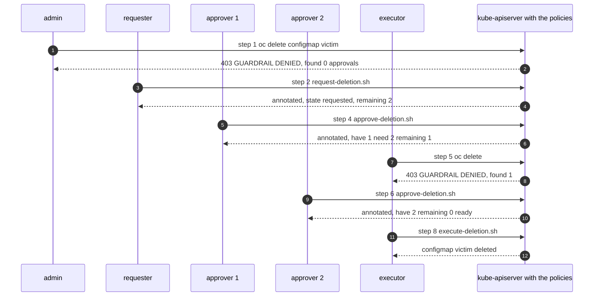

# 20 · Simulation: one critical deletion, step by step, and every attempt to cheat it

This document plays out a complete deletion of a critical resource on a **phase-3 (enforcing)** cluster, and then plays out every way an administrator could try to force or fake one. For every step you see:

1. **the command** that is run, and by whom;
2. **the expected output**, as the API server prints it;
3. **the state of the resource afterwards** (the annotations that are the workflow's memory);
4. **what is recorded and who is notified**.

Part B answers the question directly: *what happens if an admin edits the annotation values by hand, and can that let them delete something intentionally?* Every attempt is shown with its exact outcome. Part D explains **why** each one is impossible rather than merely blocked, and Part E lists the five gaps this simulation exposed, all fixed in this repository.

Related: `docs/19` (lifecycle, notifications, lifetimes), `docs/04` (the rules), `docs/14` (the manual test guide with sign-off), `scripts/test-guardrails.sh` (80 automated cases that assert exactly these outcomes).

---

## 0. The simulated environment

| Item | Value |
|---|---|
| Phase | 3 (`validationActions: [Deny, Audit]` on the deletion bindings; the `-hardened` binding is Deny in **every** phase) |
| Parameters | `minApprovers: 2`, `executorMayBeApprover: false`, `approvalTTL: 4h`, `requestTTL: 24h` |
| Target object | `configmap/victim` in namespace `guardrails-test`, labelled `guardrails.example.com/critical=true` |
| Identities | `admin@example.com` (JIT `platform-admins`, may patch and delete), `req@example.com` (`gitops-deletion-requesters`), `a1@example.com`, `a2@example.com` (`gitops-deletion-approvers`), `dev@example.com` (no guardrail role) |
| Shell helpers | as in `docs/14` §0: `as-admin`, `as-req`, `as-a1`, `as-a2`, `as-dev`, `ts()`, `state()` |

`state()` prints the guardrail annotations of the object, and is what "resource state" means below:

```bash
state() { oc -n guardrails-test get cm "$1" \
  -o go-template='{{range $k,$v := .metadata.annotations}}{{if hasPrefix $k "guardrails."}}{{$k}}={{$v}}{{"\n"}}{{end}}{{end}}'; }
```

**How many people are really needed.** Two approvers, neither of them the requester, and an executor who is not one of the approvers. The executor **may** be the requester, so the minimum is **three distinct people**: requester (who may also execute) plus two approvers. The policy never accepts fewer.



---

# Part A · The happy path, step by step

## Step 0 — the object before anything happens

```bash
$ as-admin -n guardrails-test create configmap victim --from-literal=a=b
$ as-a1 -n guardrails-test label configmap victim guardrails.example.com/critical=true
```

```text
configmap/victim created
configmap/victim labeled
```

Only an approver, a trusted GitOps identity or break-glass may attach the critical label (`guardrails-critical-label-control`); `as-admin` doing the same is denied unless the admin is also an approver.

**Resource state**

```text
$ state victim
(no output: no guardrail annotations yet)
$ oc -n guardrails-test get cm victim --show-labels
NAME     DATA   AGE   LABELS
victim   1      5s    guardrails.example.com/critical=true
```

## Step 1 — the accident: a straight delete by a cluster-admin

```bash
$ as-admin -n guardrails-test delete configmap victim
```

```text
Error from server (Forbidden): configmaps "victim" is forbidden: ValidatingAdmissionPolicy 'guardrails-critical-delete'
with binding 'guardrails-critical-delete-labelled' denied request: GUARDRAIL DENIED: deleting critical configmaps
guardrails-test/victim requires a delete-request and at least 2 distinct approvals from gitops-deletion-approvers
and a delete-requested-at time (found 0, requested-by=, executor may not be an approver).
Runbook: https://github.com/example-org/openshift-administration/blob/main/docs/09-runbooks.md
```

**Resource state:** unchanged; the object still exists.

**Recorded / notified:** audit event `verb=delete`, `responseStatus.code=403`, annotation `guardrails-critical-delete/decision = op=DELETE user=admin@example.com … approved=false exempt=false gitops=false` → **`CriticalResourceDeleteDenied`** (warning) to the platform Teams channel within ~60 s.

## Step 2 — the requester opens a request

```bash
$ KUBECONFIG=~/.kube/req.kubeconfig scripts/request-deletion.sh configmap victim -n guardrails-test "CHG0012345: decommission test instance"
```

```text
Opening deletion request on configmap/victim as req@example.com
configmap/victim annotated
Request recorded. The approvers channel is notified automatically (CriticalDeletionRequested).
2 members of gitops-deletion-approvers (not yourself) must run within 24h:
  ./approve-deletion.sh configmap victim -n guardrails-test
Resource     : configmap/victim -n guardrails-test
critical     : true
request      : CHG0012345: decommission test instance
requested-by : req@example.com
requested-at : 2026-09-19T08:00:00Z  -> expires 2026-09-20T08:00:00Z (1440 min left)
approvals    : <none>
progress     : 0 of 2 valid approvals -> 2 more approval(s) needed
```

**Resource state**

```text
$ state victim
guardrails.example.com/delete-request=CHG0012345: decommission test instance
guardrails.example.com/delete-requested-by=req@example.com
guardrails.example.com/delete-requested-at=2026-09-19T08:00:00Z
```

**Recorded / notified:** tracker annotation
`event=requested open=1 ready=0 have=0 need=2 remaining=2 requested_by=req@example.com requested_at=2026-09-19T08:00:00Z request_expires=2026-09-20T08:00:00Z first_approval_expires=none actor=req@example.com approvers="" req="CHG0012345: decommission test instance"`
→ **`CriticalDeletionRequested`** to the approvers' mailbox and Teams channel:

```text
🔵 [FIRING] CriticalDeletionRequested - configmaps guardrails-test/victim
APPROVAL NEEDED: req@example.com requests deletion of configmaps guardrails-test/victim
Reason: CHG0012345: decommission test instance. 2 approvals from gitops-deletion-approvers are needed
(not the requester). The request expires at 2026-09-20T08:00:00Z. Review the change ticket, then approve with:
scripts/approve-deletion.sh configmaps victim -n guardrails-test
- Requested by: req@example.com: CHG0012345: decommission test instance
- Request expires: 2026-09-20T08:00:00Z
```

## Step 3 — anyone can check where it stands

```bash
$ KUBECONFIG=~/.kube/a1.kubeconfig scripts/status-deletion.sh configmap victim -n guardrails-test
```

```text
Resource     : configmap/victim -n guardrails-test
critical     : true
request      : CHG0012345: decommission test instance
requested-by : req@example.com
requested-at : 2026-09-19T08:00:00Z  -> expires 2026-09-20T08:00:00Z (1438 min left)
approvals    : <none>
progress     : 0 of 2 valid approvals -> 2 more approval(s) needed
```

## Step 4 — approver 1 approves

```bash
$ KUBECONFIG=~/.kube/a1.kubeconfig scripts/approve-deletion.sh configmap victim -n guardrails-test
```

```text
Request by   : req@example.com
Reason       : CHG0012345: decommission test instance
…state…
Approve deletion of configmap/victim as a1@example.com? Type 'approve' to continue: approve
configmap/victim annotated
Approval recorded at 2026-09-19T08:05:12Z (valid for 4h). The approvers channel is notified (CriticalDeletionApproved).
progress     : 1 of 2 valid approvals -> 1 more approval(s) needed
```

**Resource state**

```text
$ state victim
guardrails.example.com/delete-request=CHG0012345: decommission test instance
guardrails.example.com/delete-requested-by=req@example.com
guardrails.example.com/delete-requested-at=2026-09-19T08:00:00Z
guardrails.example.com/delete-approvals=a1@example.com|2026-09-19T08:05:12Z
```

**Recorded / notified:** `event=approved have=1 need=2 remaining=1 first_approval_expires=2026-09-19T12:05:12Z actor=a1@example.com approvers="a1@example.com"` → **`CriticalDeletionApproved`**: *"Approval 1 of 2 recorded by a1@example.com … - 1 remaining"*. After 15 minutes without a second approval, **`CriticalDeletionPendingApproval`** repeats hourly.

## Step 5 — executing too early

```bash
$ KUBECONFIG=~/.kube/req.kubeconfig scripts/execute-deletion.sh configmap victim -n guardrails-test
```

```text
…state…
progress     : 1 of 2 valid approvals -> 1 more approval(s) needed
Only 1 distinct approvals, 2 required. Deletion will be denied.
```

The script stops before calling the API. Bypassing the script hits the policy:

```bash
$ as-req -n guardrails-test delete configmap victim
→ Error from server (Forbidden): … GUARDRAIL DENIED: deleting critical configmaps guardrails-test/victim requires …
  (found 1, requested-by=req@example.com, executor may not be an approver). …
```

**Resource state:** unchanged.

## Step 6 — approver 2 approves

```bash
$ KUBECONFIG=~/.kube/a2.kubeconfig scripts/approve-deletion.sh configmap victim -n guardrails-test
```

```text
configmap/victim annotated
Approval recorded at 2026-09-19T09:40:03Z (valid for 4h). The approvers channel is notified (CriticalDeletionApproved).
progress     : 2 of 2 valid approvals -> FULLY APPROVED: a third person (not an approver) may execute
```

**Resource state**

```text
guardrails.example.com/delete-approvals=a1@example.com|2026-09-19T08:05:12Z,a2@example.com|2026-09-19T09:40:03Z
```

**Notified:** *"Approval 2 of 2 recorded by a2@example.com … - FULLY APPROVED"*, with *"may now run scripts/execute-deletion.sh before 2026-09-19T12:05:12Z, when the oldest approval expires"*. If nobody executes for 30 minutes, **`CriticalDeletionAwaitingExecution`** repeats hourly.

## Step 7 — an approver tries to execute

```bash
$ as-a1 -n guardrails-test delete configmap victim
```

```text
Error from server (Forbidden): … GUARDRAIL DENIED: deleting critical configmaps guardrails-test/victim requires
a delete-request and at least 2 distinct approvals … (found 2, requested-by=req@example.com,
executor may not be an approver). …
```

Two approvals exist, yet the deletion is refused because the deleter is one of the approvers (`executorMayBeApprover: false`). **Resource state:** unchanged.

## Step 8 — the executor deletes

```bash
$ KUBECONFIG=~/.kube/req.kubeconfig scripts/execute-deletion.sh configmap victim -n guardrails-test
```

```text
…state…
progress     : 2 of 2 valid approvals -> FULLY APPROVED: a third person (not an approver) may execute
Delete configmap/victim -n guardrails-test NOW as req@example.com? Type the resource name to confirm: victim
configmap "victim" deleted
Deletion accepted. Expect CriticalResourceDeleted (email + Teams) within ~60s.
Audit trail (Loki / logcli):
  logcli query --org-id=audit '{log_type="audit"} | json | objectRef_name="victim" | verb=~"patch|update|delete"' --since=24h
```

**Resource state:** the object no longer exists, and its annotations went with it.

```text
$ state victim
Error from server (NotFound): configmaps "victim" not found
```

**Recorded / notified:** `decision = op=DELETE user=req@example.com … approved=true exempt=false`; tracker `event=executed`. Two messages: **`CriticalResourceDeleted`** (critical, red, email + Teams, repeats every 30 min until acknowledged) and **`CriticalDeletionRequestClosed`** (`event=executed`) to the approvers.

## Step 9 — the evidence afterwards

```bash
$ logcli query --org-id=audit --since=24h \
  '{log_type="audit"} | json | objectRef_name="victim" | verb=~"patch|update|delete"
   | line_format "{{.requestReceivedTimestamp}} {{.verb}} {{.user_username}} {{.responseStatus_code}} {{.annotations_guardrails_deletion_tracker_state}}"'
```

```text
2026-09-19T07:58:02Z delete admin@example.com 403
2026-09-19T08:00:00Z patch  req@example.com   200 event=requested have=0 need=2 remaining=2 …
2026-09-19T08:05:12Z patch  a1@example.com    200 event=approved  have=1 need=2 remaining=1 …
2026-09-19T09:38:55Z delete req@example.com   403
2026-09-19T09:40:03Z patch  a2@example.com    200 event=approved  have=2 need=2 remaining=0 ready=1 …
2026-09-19T09:41:10Z delete a1@example.com    403
2026-09-19T09:42:31Z delete req@example.com   200 event=executed  have=2 need=2 …
```

Every step, including each refusal, is attributable. The same query runs in Splunk (`scripts/audit-query.sh victim` prints both).

---

# Part B · Tampering: what happens if an admin edits the annotations by hand

Setup for this part: the object exists again, labelled critical, with an open request by `req@example.com` and **one** approval from `a1@example.com`. `admin@example.com` is a JIT `platform-admins` member — the strongest identity a human can hold here (`guardrails-platform-admin`: every verb except `impersonate`, `escalate`, `bind`) — and is **not** in the approver group.

**Summary: what a human can and cannot write**

| Annotation change | Allowed? | Rule |
|---|---|---|
| Add an approval entry naming **yourself**, if you are an approver, not the requester, not already listed | yes | V3 |
| Add an approval entry naming **anyone else** | no | V3 |
| Add two entries at once | no | V3 |
| Re-add yourself (also with different capitalisation) | no | V3 |
| Change or reorder existing entries | no | V3 |
| Delete **all** approvals (cancel) | yes, and it only makes deletion harder | V3 |
| Delete **some** approvals | no (only the reaper may prune) | V3 |
| Open a request naming yourself, with a reason and a valid time | yes | V4 |
| Open a request naming someone else | no | V4 |
| Edit the reason or the time while approvals exist | no | V4 |
| Clear the whole request | yes | V4 |
| Remove the critical label | no | V2 |
| Change anything else in the same write as an approval | no | V3/V4 `payloadUnchanged` |

## A1 — write both approvals in one command

```bash
$ as-admin -n guardrails-test annotate configmap victim --overwrite \
    "guardrails.example.com/delete-approvals=a1@example.com|$(ts),a2@example.com|$(ts)"
```

```text
Error from server (Forbidden): configmaps "victim" is forbidden: ValidatingAdmissionPolicy 'guardrails-critical-delete'
with binding 'guardrails-critical-delete-labelled' denied request: GUARDRAIL DENIED: invalid change to
guardrails.example.com/delete-approvals by admin@example.com. Rules: append exactly one entry
"<your-username>|<RFC3339 UTC>", be a member of gitops-deletion-approvers, not be the requester, not approve twice,
change nothing else in the object. Clearing the annotation is always allowed.
```

**State:** unchanged (still one approval). **Why impossible:** V3 accepts at most **one added entry**, and that entry must literally contain `request.userInfo.username` — the name the API server authenticated, which the caller cannot choose.

## A2 — append one approval, but name an approver

```bash
$ as-admin -n guardrails-test annotate configmap victim --overwrite \
    "guardrails.example.com/delete-approvals=a1@example.com|2026-09-19T08:05:12Z,a2@example.com|$(ts)"
```

```text
Error from server (Forbidden): … GUARDRAIL DENIED: invalid change to guardrails.example.com/delete-approvals by admin@example.com …
```

**State:** unchanged. Even a perfectly formed entry fails: `addedApprovals[0].split('|')[0] == request.userInfo.username` is false, and no flag, header or field lets a caller change that value. The only way to make it true is to *be* `a2@example.com`, which means holding that person's credentials (an incident in its own right, alerted by `ImpersonationUsed` if attempted with `--as`, see A12).

## A3 — the admin joins the approver group first

```bash
$ as-admin patch group gitops-deletion-approvers --type merge -p '{"users":["a1@example.com","a2@example.com","admin@example.com"]}'
```

```text
Error from server (Forbidden): groups.user.openshift.io "gitops-deletion-approvers" is forbidden:
ValidatingAdmissionPolicy 'guardrails-gitops-only-mutation' with binding 'guardrails-gitops-only-mutation-hardened'
denied request: GUARDRAIL: critical groups gitops-deletion-approvers may only be changed through Git (Argo CD) -
direct edit by admin@example.com is not permitted. Open a PR.
```

**State:** group unchanged. Approver groups are in the self-protection set: **Deny in every phase**, including phase 1. Through Git it needs two reviewers and code-owner approval from platform *and* security, and it fires `PrivilegedRBACChange`.

## A4 — approve twice, the second time with different capitalisation

```bash
$ as-a1 -n guardrails-test annotate configmap victim --overwrite \
    "guardrails.example.com/delete-approvals=a1@example.com|2026-09-19T08:05:12Z,A1@EXAMPLE.COM|$(ts)"
```

```text
Error from server (Forbidden): … GUARDRAIL DENIED: invalid change to guardrails.example.com/delete-approvals by a1@example.com …
```

**State:** unchanged. Duplicate detection and the "requester is not an approver" and "executor is not an approver" checks all compare lower-cased names, so a second identity that differs only in case counts as the same person (gap **G11**, fixed).

## A5 — a malformed or back-dated entry

```bash
$ as-a1 -n guardrails-test annotate configmap victim --overwrite \
    "guardrails.example.com/delete-approvals=a1@example.com|2026-09-19T08:05:12Z,a2@example.com|soon"
→ Error from server (Forbidden): … invalid change to guardrails.example.com/delete-approvals by a1@example.com …   (regex rejects it)
```

A *well-formed but old* timestamp is accepted at admission (CEL has no clock) and is removed by the reaper within 10 minutes, which also notifies the approvers (`CriticalDeletionApprovalsExpired`):

```text
$ oc -n guardrails-system logs job/approval-reaper-…
expire configmaps guardrails-test/victim approver=a2@example.com at=2000-01-01T00:00:00Z (ttl or future/invalid timestamp)
pending configmaps guardrails-test/victim requested_at=2026-09-19T08:00:00Z approvals=a1@example.com|2026-09-19T08:05:12Z
```

A *future* timestamp (an attempt to make an approval outlive its TTL) is removed the same way when it is more than 5 minutes ahead.

## A6 — smuggle a real change into an approval

```bash
$ as-a2 -n guardrails-test patch configmap victim --type merge \
    -p '{"metadata":{"annotations":{"guardrails.example.com/delete-approvals":"a1@example.com|2026-09-19T08:05:12Z,a2@example.com|2026-09-19T09:40:03Z"}},"data":{"a":"hacked"}}'
```

```text
Error from server (Forbidden): … GUARDRAIL DENIED: invalid change to guardrails.example.com/delete-approvals by a2@example.com …
```

**State:** unchanged, including `data`. An approval write may change **nothing** but the guardrail annotations: `payloadUnchanged` compares `spec`, `data`, `stringData`, `binaryData`, `immutable`, `rules`, `subjects`, `roleRef`, `users`, `webhooks`, `aggregationRule`, `secrets`, `imagePullSecrets`, `automountServiceAccountToken`, Application `operation`, labels, finalizers and ownerReferences (the last four fields were added as gap **G10**).

## A7 — unlabel it, then delete it

```bash
$ as-admin -n guardrails-test label configmap victim guardrails.example.com/critical-
```

```text
Error from server (Forbidden): configmaps "victim" is forbidden: ValidatingAdmissionPolicy 'guardrails-critical-delete'
with binding 'guardrails-critical-delete-labelled' denied request: GUARDRAIL DENIED: removing the
guardrails.example.com/critical label requires the same approvals as a deletion.
```

**Why it cannot be raced:** the binding's `objectSelector` is evaluated against the old **or** the new object, so a request that removes the label still matches the policy, and V2 denies it.

## A8 — change the reason after the approvals are in, or refresh the clock

```bash
$ as-req -n guardrails-test annotate configmap victim --overwrite "guardrails.example.com/delete-request=CHG0012345: delete the production instance instead"
→ Error from server (Forbidden): … GUARDRAIL DENIED: invalid deletion request change by req@example.com. delete-requested-by must
  equal your username, you must be in gitops-deletion-requesters,gitops-operators,gitops-deletion-approvers, delete-request must be
  non-empty, delete-requested-at must be an RFC3339 UTC time (YYYY-MM-DDThh:mm:ssZ), approvals must be empty when the request
  changes, and nothing else may change.

$ as-req -n guardrails-test annotate configmap victim --overwrite "guardrails.example.com/delete-requested-at=$(ts)"
→ Error from server (Forbidden): … same message …
```

**State:** unchanged. Approvals are bound to the exact text, author and time they were given for. Re-opening the request with `request-deletion.sh` is allowed, and it clears the approvals in the same write — so the approvers must look at the new reason.

## A9 — sabotage: clear the approvals or the request

```bash
$ as-admin -n guardrails-test annotate configmap victim --overwrite "guardrails.example.com/delete-approvals-"
→ configmap/victim annotated
```

This **is** allowed, for everyone with patch rights, and it is the one hand edit that succeeds. It can only *remove* progress, never create it, and it is not silent: the tracker records `event=approvals-cleared actor=admin@example.com`, the approvers are told (`CriticalDeletionRequestClosed`), and `status-deletion.sh` shows `0 of 2`. The same applies to `cancel-deletion.sh`. Deleting the object right afterwards is refused (`found 0`).

## A10 — turn off the guardrail first

```bash
$ as-admin patch validatingadmissionpolicybinding guardrails-critical-delete-labelled --type merge -p '{"spec":{"validationActions":["Audit"]}}'
→ Error from server (Forbidden): … binding 'guardrails-gitops-only-mutation-hardened' denied request: GUARDRAIL: critical
  validatingadmissionpolicybindings guardrails-critical-delete-labelled may only be changed through Git (Argo CD) …

$ as-admin patch guardrailconfig default --type merge -p '{"spec":{"minApprovers":1,"exemptUsers":["system:apiserver","admin@example.com"]}}'
→ Error from server (Forbidden): … 'guardrails-gitops-only-mutation-hardened' denied request …

$ as-admin delete validatingadmissionpolicybinding guardrails-critical-delete-labelled
→ Error from server (Forbidden): … GUARDRAIL DENIED: deleting critical validatingadmissionpolicybindings … (found 0, …)

$ as-admin -n guardrails-system patch cronjob approval-reaper --type merge -p '{"spec":{"suspend":true}}'
→ Error from server (Forbidden): … 'guardrails-gitops-only-mutation-hardened' denied request …
```

Through Git these changes need two reviewers, and the CI invariants reject `minApprovers < 2`, a human in `exemptUsers`, or a binding that drops `Deny`. If the policy objects were somehow removed, Argo CD self-heal restores them within about 3 minutes and `GuardrailPolicyModified` pages the on-call.

<a id="a8"></a>

## A11 — repoint the guardrails Application at the audit-only overlay

The subtle one, and a **real gap found by this simulation** (**G9**, now fixed). Each overlay renders the Application pointing at itself, so a single patch used to be enough to move the cluster back to phase 1 permanently — applied, legitimately, by the exempt Argo CD controller.

```bash
$ as-admin -n openshift-gitops patch application guardrails --type merge -p '{"spec":{"source":{"path":"manifests/overlays/phase1-audit"}}}'
```

```text
Error from server (Forbidden): applications.argoproj.io "guardrails" is forbidden: ValidatingAdmissionPolicy
'guardrails-gitops-only-mutation' with binding 'guardrails-gitops-only-mutation-hardened' denied request:
GUARDRAIL: critical applications openshift-gitops/guardrails may only be changed through Git (Argo CD) -
direct edit by admin@example.com is not permitted. Open a PR.
```

Critical `Application`, `ApplicationSet`, `AppProject` and `ArgoCD` objects are now in the always-Deny set. Tenant Applications are not labelled critical and are unaffected. A phase change is a PR: Git renders the new path and the Argo CD controller applies it.

## A12 — create a *new* Application that applies whatever you like

Because the Argo CD controller is exempt, anything it applies is pre-approved. Creating an Application is a CREATE, which the mutation policy does not cover, so the remaining control is Argo CD's own fencing — and the stock `default` project allows every repo and kind (**G12**, now fixed by shipping a locked `default` project):

```bash
$ as-admin -n openshift-gitops apply -f - <<'EOF'
apiVersion: argoproj.io/v1alpha1
kind: Application
metadata: { name: totally-normal, namespace: openshift-gitops }
spec:
  project: default
  source: { repoURL: https://github.com/attacker/stuff.git, targetRevision: HEAD, path: . }
  destination: { server: https://kubernetes.default.svc, namespace: guardrails-system }
  syncPolicy: { automated: { prune: true } }
EOF
→ application.argoproj.io/totally-normal created
```

```text
$ oc -n openshift-gitops get application totally-normal -o jsonpath='{.status.conditions[*].message}'
application repo https://github.com/attacker/stuff.git is not permitted in project 'default'
```

Nothing is applied. The `default` project has empty `sourceRepos`, `destinations` and whitelists, so no Application placed in it can sync anywhere, and the project itself is critical (editing it needs Git — see A10). Creating the Application is still reported: **`ArgoCDApplicationWrittenOutOfBand`** (warning) names the user, object and verb, so the platform team removes it. Legitimate applications live in named projects defined in Git.

## A13 — impersonate an approver

```bash
$ as-admin --as=a2@example.com --as-group=gitops-deletion-approvers -n guardrails-test annotate configmap victim --overwrite \
    "guardrails.example.com/delete-approvals=a1@example.com|2026-09-19T08:05:12Z,a2@example.com|$(ts)"
```

```text
Error from server (Forbidden): configmaps "victim" is forbidden: ValidatingAdmissionPolicy
'guardrails-impersonation-dry-run-only' with binding 'guardrails-impersonation-dry-run-only' denied request:
GUARDRAIL DENIED: a2@example.com has no authentication marker (scopes.authorization.openshift.io), so this session
is impersonated or uses a legacy token. Impersonation may only be used with --dry-run=server or for reads;
log in as yourself to UPDATE configmaps victim.
```

The request arrives under the impersonated name (`a2@example.com`), which is exactly why it fails: a real session of that person carries the OAuth marker, and this one does not.

Even with `--dry-run=server`, the write is evaluated as an ordinary user: an impersonated session does not carry the OAuth marker in `userInfo.extra`, so `isApprover` is false and V3 denies it. Nobody may impersonate `userextras`, so the marker cannot be forged (docs/17). Both `ImpersonationUsed` and `ImpersonatedWriteDenied` fire.

## A14 — force, cascade, collection and replace

```bash
$ as-admin -n guardrails-test delete configmap victim --force --grace-period=0
→ Error from server (Forbidden): … GUARDRAIL DENIED: deleting critical configmaps guardrails-test/victim …

$ as-admin -n guardrails-test delete configmap -l guardrails.example.com/critical=true
→ Error from server (Forbidden): … GUARDRAIL DENIED: … (one denial per matched object)

$ as-admin -n guardrails-test replace --force -f victim.yaml
→ Error from server (Forbidden): … GUARDRAIL DENIED: deleting critical configmaps …   (--force replaces = delete + create)

$ as-admin -n guardrails-test delete configmap victim --cascade=orphan --wait=false
→ Error from server (Forbidden): … GUARDRAIL DENIED: deleting critical configmaps …
```

None of these are a different code path: every one of them is a DELETE admission request, and V1 sees them all.

## A15 — let the garbage collector do it

```bash
$ as-admin -n guardrails-test patch configmap victim --type merge \
    -p '{"metadata":{"ownerReferences":[{"apiVersion":"v1","kind":"ConfigMap","name":"disposable","uid":"…"}]}}'
→ configmap/victim patched          # allowed in phase 3 unless the object is in the self-protection set
$ as-admin -n guardrails-test delete configmap disposable
→ configmap "disposable" deleted
```

The garbage collector now tries to delete `victim` and is refused, because it is not an exempt identity:

```text
$ oc -n guardrails-test get cm victim
NAME     DATA   AGE
victim   1      2h                # still there

audit: verb=delete user=system:serviceaccount:kube-system:generic-garbage-collector responseStatus=403
       decision="op=DELETE … approved=false exempt=false"
```

The repeated denials raise `CriticalResourceDeleteDenied` naming the garbage collector, which is the signal that someone tried this. In phase 4 the ownerReference edit itself is denied, and for the self-protection set it is denied in every phase.

<a id="a9"></a>

## A16 — delete the whole namespace instead

```bash
$ as-admin delete namespace guardrails-test
→ namespace "guardrails-test" deleted        # the namespace itself is not critical
$ oc get ns guardrails-test
NAME              STATUS        AGE
guardrails-test   Terminating   3h
```

The namespace controller must delete the contents, and its deletes of the critical object are refused, so the namespace stays `Terminating` and the object survives. This is safe but messy, so **`NamespaceStuckTerminating`** now fires after 20 minutes (gap **G13**) and points at `list-pending-deletions.sh`. The cure is to finish the object through the workflow (or remove the label through Git); the namespace then completes on its own. The platform namespaces (`openshift-gitops`, `guardrails-system`, …) are critical by name, so this step is already refused for them.

## A17 — install a mutating webhook that adds approvals

A mutating webhook runs **before** the policies, so it can add annotations to an object in flight. It gains nothing: the policies compare the incoming object against the stored one, and the injected entries do not name the caller, so V3 denies the write, whoever triggered it.

```text
$ as-dev -n guardrails-test annotate configmap victim foo=bar        # webhook injects two approvals
→ Error from server (Forbidden): … GUARDRAIL DENIED: invalid change to guardrails.example.com/delete-approvals by dev@example.com …
```

Creating the webhook configuration is itself reported now: **`AdmissionWebhookConfigurationChanged`** (critical, security).

## A18 — use a service account you control as the approver

Adding a service account to the approver group is denied (A3). Even if its name were in the group, `isApprover` also requires the **human** OAuth marker, which a service-account token never carries, so the approval is denied. Minting a token for a privileged service account raises `PrivilegedTokenMinted`, and using the break-glass identity raises `BreakGlassUsed` (P1) and is reviewed afterwards.

## A19 — simply wait

An approval is valid for 4 hours and a request for 24. Collecting one approval today and a second tomorrow does not work: the reaper removes the first one and tells the approvers. Stopping the reaper to prevent that is denied (A10) and alerted (`GuardrailReaperNotRunning`).

## A20 — the phase-1 and phase-2 caveat

Everything above assumes phase 3. In phases 1 and 2 the same evaluation runs, but the bindings only record or warn, so these commands **succeed** and are recorded instead:

```text
$ as-admin -n guardrails-test annotate configmap victim --overwrite "guardrails.example.com/delete-approvals=a1@example.com|$(ts),a2@example.com|$(ts)"
Warning: Validation failed for ValidatingAdmissionPolicy 'guardrails-critical-delete' with binding
'guardrails-critical-delete-labelled': GUARDRAIL DENIED: invalid change …          (phase 2 prints this; phase 1 is silent)
configmap/victim annotated
```

with `CriticalDeleteWouldBeDenied` as the rollout signal. This is deliberate: the first two phases exist to find legitimate workflows that would break. The exception is the self-protection set (A3, A10, A11), which is Deny from day one.

---

# Part C · The state table

The complete life of the annotations in Part A, and what each state means to the policy:

| After step | `delete-request` | `delete-requested-by` | `delete-requested-at` | `delete-approvals` | `have/need` | DELETE allowed for |
|---|---|---|---|---|---|---|
| 0 | – | – | – | – | 0/2 | nobody (except GitOps path / break-glass) |
| 2 request | `CHG0012345: …` | `req@example.com` | `2026-09-19T08:00:00Z` | – | 0/2 | nobody |
| 4 approval 1 | unchanged | unchanged | unchanged | `a1@…\|08:05:12Z` | 1/2 | nobody |
| 6 approval 2 | unchanged | unchanged | unchanged | `a1@…\|08:05:12Z,a2@…\|09:40:03Z` | 2/2 | anyone with delete rights **except** `a1`, `a2` |
| 8 executed | object gone | | | | | – |
| reaper after 4 h | unchanged | unchanged | unchanged | entries older than 4 h removed | back to 1/2 or 0/2 | nobody |
| reaper after 24 h | cleared | cleared | cleared | cleared | 0/2 | nobody |

---

# Part D · Why forging is impossible, not merely blocked

| Claim | Mechanism |
|---|---|
| An approval cannot be written on behalf of someone else | V3 compares the appended entry to `request.userInfo.username`, which the **API server** fills in from the authenticated credential. It is not part of the request body and no client flag changes it. |
| An admin cannot collect both approvals | Only one entry may be added per write, it must name the caller, and the caller must not already appear in the list (compared case-insensitively). |
| An admin cannot give themselves the approver role | `isApprover` reads `request.userInfo.groups`, filled from the IdP identity. Editing the group object is denied in every phase and needs a two-reviewer PR. |
| An admin cannot pretend to be an approver with `--as` | RBAC grants nobody `impersonate` on `userextras`, so an impersonated session lacks the OAuth marker; impersonated writes are denied unless `--dry-run=server`, and exemptions and approver status are ignored for them. |
| An admin cannot weaken the rule | `GuardrailConfig`, the policies and their bindings, the approver groups, the reaper CronJob and the Argo CD objects that select the phase are all Deny-in-every-phase for humans; Git requires two reviewers and CI refuses weakening. |
| An admin cannot remove the protection from the object | V2 (label) and the `objectSelector` that matches the old object. |
| An admin cannot route around admission | Every path (`--force`, `--cascade`, `deletecollection`, `replace --force`, the garbage collector, the namespace controller, a mutating webhook, a new Argo CD Application) ends in an admission request for that object, or in an identity that is not exempt. |
| A stale approval cannot be reused | `approvalTTL` 4 h and `requestTTL` 24 h, enforced by the reaper, whose own identity may only remove entries; stopping it is denied and alerted. |
| Nothing is silent | Every step and every refusal is in the audit trail with the actor, and the alerts in docs/19 §6.2 cover request, approval, expiry, closure, denial and deletion. |

**What is still true and must be accepted** (residual, `docs/01`): the `system:masters` installer certificate bypasses RBAC and could forge the markers — it is vaulted under dual control and alerted; node or etcd access is below admission; three colluding people (a requester and two approvers) can legitimately delete anything; and in phases 1 and 2 nothing is blocked by design.

---

# Part E · Gaps this simulation exposed, and their fixes

| # | Severity | Gap | Fix | Where |
|---|---|---|---|---|
| G9 | **Critical** | Each overlay renders the guardrails Application pointing at itself, and the hardened binding did not cover Argo CD objects. One `oc patch` of `spec.source.path` moved the cluster back to phase 1 **permanently**, applied by the exempt Argo CD controller, with only an audit-level signal. | critical `applications`, `applicationsets`, `appprojects` and `argocds` added to the always-Deny `-hardened` binding; CI invariant requires it | `vap-gitops-only-mutation.yaml`, `policy-ci.yaml`, automated §4 |
| G10 | Medium | `payloadUnchanged` did not compare `stringData`, `secrets`, `imagePullSecrets` or `automountServiceAccountToken`, so an approval write could have carried such a change on a Secret or ServiceAccount | the four fields added to both policies | `vap-critical-delete.yaml`, `vap-gitops-only-mutation.yaml` |
| G11 | Medium | Approver identities were compared exactly, so two spellings of one identity (`a1@…`, `A1@…`) could count as two approvers | distinctness, "requester is not an approver" and "executor is not an approver" compare lower-cased | `vap-critical-delete.yaml`, automated §6 |
| G12 | High | Argo CD's stock `default` AppProject permits every repo, destination and kind: anyone who can create an Application could have the **exempt** controller apply arbitrary manifests | a locked `default` AppProject (empty repos, destinations and whitelists), labelled critical so edits need Git; CI keeps it empty; new alert `ArgoCDApplicationWrittenOutOfBand` | `appproject-default-locked.yaml`, `loki-alertingrules-audit.yaml`, `policy-ci.yaml` |
| G13 | Low | A namespace holding a critical object stays `Terminating` forever with no alert; webhook configuration changes were not alerted | `NamespaceStuckTerminating` (20 min) and `AdmissionWebhookConfigurationChanged` | `prometheusrule-gitops-health.yaml`, `loki-alertingrules-audit.yaml` |

Earlier rounds: `docs/19` §9 (D1, D2, G1–G8) and `docs/16` (the 59-finding review).

---

# Part F · Running this simulation yourself

```bash
# everything in Part A and most of Part B, asserted automatically, in a scratch namespace:
scripts/test-guardrails.sh                 # 80 cases, phase-aware, evidence in evidence/<timestamp>.log

# the same scenarios by hand, with expected output for sign-off:
#   docs/14 §4 (forged approvals), §5 (happy path), §6 (cancel, expiry, status, notifications), §3/§8 (self-protection)

# proof that the notifications arrived (keep for the audit file):
#   Teams screenshots + the email headers, plus:
scripts/audit-query.sh victim
```

Evidence to keep for a phase-3 go-live: the test log, the Loki query output from Step 9, the approvers' notifications from Steps 2, 4 and 6, and the four denial messages from A1, A2, A10 and A11.
